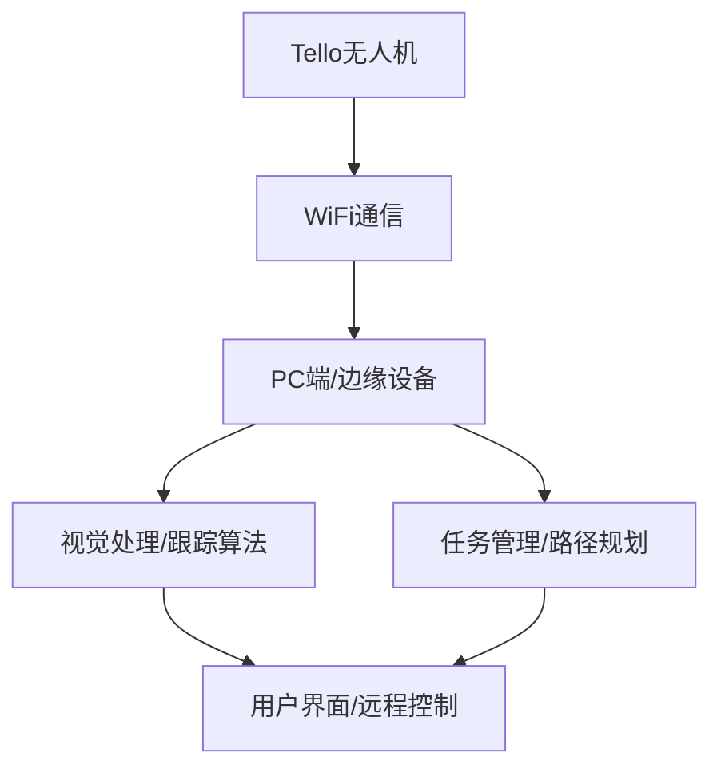

# 项目名称：基于Tello无人机的室内智能视觉巡检与自动跟踪系统

## 1 项目简介

​	本项目旨在利用DJI Tello消费级无人机，搭建一套低成本、易复现的室内智能巡检与自动跟踪系统。通过集成计算机视觉算法与自定义控制策略，实现对目标（如人员、物体等）的自动识别、跟踪与巡航。系统支持定时/手动巡检、目标丢失自动恢复、远程指令下发等多种功能，适用于家庭智能助手、实验室巡视、教育演示等多元场景。

​	本项目采用模块化设计，兼容开源社区常用视觉算法（如OpenCV/YOLO），并对接Tello官方SDK，支持二次开发和定制扩展，方便开发者和学生快速上手和二次开发。

## 2 核心功能

**目标检测与自动跟踪**

- 基于计算机视觉算法（如OpenCV、YOLO等）实现对指定目标（人员/物体）的自动识别与动态跟踪。
- 支持目标丢失后自动重新搜索与锁定。

**室内自主巡检与路径规划**

- 支持设定预定巡检路线，实现室内定点/全域自动巡航。
- 可自定义巡检任务、路线和时间表。

**远程控制与实时视频回传**

- 提供基于WiFi的远程控制接口，实现实时视频流回传与远程手动干预。
- 支持通过PC端/移动端进行任务下发与状态监控。

**多模式任务切换**

- 巡检模式与跟踪模式一键切换，支持手动与自动模式灵活切换。

**易用的模块化架构**

- 支持主流视觉算法热插拔，代码结构清晰，便于二次开发。
- 兼容多种扩展应用场景（如教育、演示等）。

**异常检测与告警**

- 支持自主识别异常状况（如目标丢失、电量过低等），自动返回或发出告警通知。

## 3 系统架构

本系统采用**模块化分层架构**，主要分为三大部分：

- **感知层（Tello无人机+摄像头）**：负责图像采集和飞行控制。
- **智能处理层（视觉算法与任务逻辑）**：基于PC或边缘设备运行视觉识别、路径规划和任务调度。
- **控制与交互层（远程指令与监控）**：实现与用户的远程交互、任务配置、视频回传和异常告警



## 4 主要成果

- 实现基于Tello无人机的**室内目标检测与自动跟踪**功能，支持远程实时控制与视频回传。

- 完成**自主巡检与路径规划**，支持多种室内巡检/跟踪应用场景。

- 提供**模块化开源代码与详细文档**，方便开发者快速复现和二次开发。

## 5 快速运行指南

#### （1） 克隆项目代码

```
git clone https://github.com/SONG-36/tello-vision-inspection.git
cd tello-vision-inspection
```

#### （2）安装依赖环境

以Python为例（具体依赖见`requirements.txt`）：

```
pip install -r requirements.txt
```

#### （3）配置Tello无人机

- 确保Tello无人机已开机并连接至PC的WiFi
- （可选）修改配置文件，如`config.yaml`，填写WiFi信息或任务参数

#### （4）启动系统

以主程序 `main.py` 为例：

```
python main.py
```

#### （5）体验功能

- 打开PC端显示界面，查看视频回传和目标跟踪状态
- 可通过界面或命令行下发巡检/跟踪任务指令
- 按说明关闭系统并安全断开无人机连接

## 6 依赖环境

| 分类         | 依赖项                            | 说明                                                         |
| ------------ | --------------------------------- | ------------------------------------------------------------ |
| **硬件环境** | DJI Tello无人机                   | 一台                                                         |
|              | 支持WiFi的PC/边缘设备             | Windows 10/11 或 Ubuntu 20.04/22.04 推荐                     |
|              | 外接摄像头/显示器（可选）         | 扩展硬件，根据需求选配                                       |
| **软件环境** | 操作系统                          | Windows 10/11，Ubuntu 20.04/22.04                            |
|              | Python 版本                       | Python 3.8 及以上                                            |
|              | Tello SDK支持库                   | 如 [djitellopy](https://github.com/damiafuentes/DJITelloPy) 或官方SDK |
|              | opencv-python                     | 图像处理                                                     |
|              | numpy                             | 科学计算                                                     |
|              | requests                          | 网络通信                                                     |
|              | PyYAML                            | 配置文件解析                                                 |
|              | torch / yolov5（可选）            | 目标检测/深度学习                                            |
| **依赖安装** | `pip install -r requirements.txt` | 一键安装全部依赖                                             |
| **其它要求** | WiFi局域网连接                    | 保证PC与Tello处于同一WiFi                                    |
|              | 网络权限                          | 用于下载安装依赖                                             |

## 7 目录结构说明


