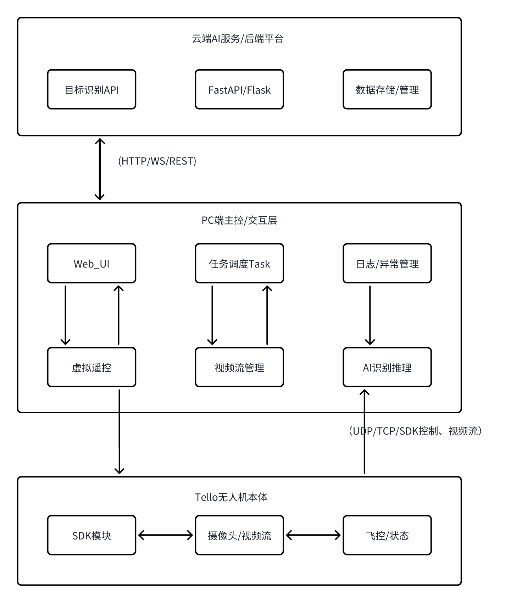
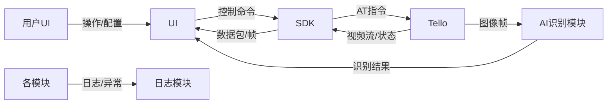

# 项目系统架构设计

## 1 项目背景与目标

### 1.1 项目背景

#### 1.1.1 项目发起原因

- 本项目源自于【课程设计/创新创业/企业需求】。目的是实现一套基于Python的多线程任务调度与视觉识别的无人机控制系统。
- 传统无人机SDK应用存在“单线程指令、界面割裂、调试繁琐”等问题，难以扩展AI识别/多端接入等高级功能。
- 该项目希望将“**工程项目开发、AI算法落地与任务调度思想**”结合起来，锻炼并输出可实际部署、可演示、可二次开发的完整系统。

#### 1.1.2 现有痛点/问题

- 无法统一调度“视频流、AI识别、手动控制”多任务，缺乏高层抽象与自动化机制。
- 大多数入门代码缺少“工程化设计与系统文档”，难以作为团队协作/二次开发基础。
- 市场上缺乏“**面向学生/工程师/创新实践**”的、可扩展的开源无人机Web/多端控制系统模板。

#### 1.1.3 目标用户/场景

- **高校/研究生/本科生课程设计**（工程实践、自动化/AI实验）
- **AI创新比赛/学术竞赛**（如RoboMaster、华为松山湖AI大赛等）
- **企业级无人机业务原型**（自动巡检、AI识别、教学/演示等）

### 1.2 项目目标

#### 1.2.1 总体目标

- **开发一套多线程任务调度与视觉识别集成的Tello无人机控制系统**，支持手动/自动控制、实时视频流、Web多端展示、AI扩展等功能。

#### 1.2.2 阶段目标

1. **基础控制与通讯**：支持无人机的起飞、降落、前后左右等基础SDK指令；
2. **视频流接入与展示**：可实时显示无人机摄像头视频流，支持本地与网页浏览器展示；
3. **AI/自动任务扩展**：预留AI识别/自动巡航等高级任务入口，便于学生/开发者二次开发。

#### 1.2.3 可交付物

- 完整源代码（结构清晰，模块分层）
- UI/网页端界面（streamlit或gradio实现，便于本地/远程展示）
- 技术设计文档（本设计文档，含系统架构、模块说明、流程图等）
- 部署与使用手册（开发环境搭建、依赖安装、快速启动流程）

### 1.3 系统设计约束与性能目标

#### 1.3.1 平台约束

- 操作系统：优先支持Windows 10/11、Ubuntu 20.04+，可适配其他主流平台
- Python版本：3.8及以上
- 主要依赖库：opencv-python、streamlit、numpy等（详细见requirements.txt）

#### 1.3.2 性能约束

- **实时性**：视频流展示延迟低于0.5s，AI识别流程整体延迟可控（<1s/帧）
- **最低帧率**：视频流展示不少于10FPS（视网络和设备实际情况而定）
- **多任务协同**：任务调度与UI展示互不阻塞，核心指令/识别不丢失

#### 1.3.3 安全与异常处理要求

- 通信异常自动重连与异常日志记录
- 各任务线程均可平滑退出，不影响主流程
- 支持手动/自动故障恢复机制

## 2 系统需求分析

### 2.1 需求汇总

#### 2.1.1 核心业务需求清单

| 需求编号 | 需求内容                               | 优先级 | 备注                               |
| -------- | -------------------------------------- | ------ | ---------------------------------- |
| BR-01    | 一键启动室内自动巡检/跟踪任务          | 高     | 支持自定义巡检路径、目标类型       |
| BR-02    | 对特定目标的智能检测、识别与动态跟踪   | 高     | 支持人物、宠物、物品等多类型       |
| BR-03    | 上位机端（PC端）集成**可视化交互界面** | 高     | 实时显示视频流、识别结果、任务管理 |
| BR-04    | 上位机端**虚拟遥控器与任务配置面板**   | 高     | 提供图形化按钮与任务参数设置       |
| BR-05    | 视频流实时回传与历史数据存档           | 高     | 支持远程查看、历史回放             |
| BR-06    | 异常状况自动识别与智能提示             | 高     | 如目标丢失、电量低、通信中断等     |
| BR-07    | 用户自定义巡检模板和执行计划           | 中     | 支持任务模板保存与周期执行         |
| BR-08    | 系统开源、模块化，便于扩展与二次开发   | 高     | 预留API，支持教学、创新、比赛等    |
| BR-09    | 简单部署与便捷维护                     | 高     | 一键安装、自动配置                 |

#### 2.1.2 功能性需求（Functional Requirements）

（1）无人机端核心功能

| 编号  | 技术需求内容                     | 优先级 | 验收标准                               |
| ----- | -------------------------------- | ------ | -------------------------------------- |
| TR-01 | 实现Tello无人机基础控制接口      | 高     | 起飞/降落/定点移动指令无延迟响应       |
| TR-02 | 实时采集与回传摄像头视频流       | 高     | 无人机端视频流稳定推送、PC端可流畅显示 |
| TR-03 | 集成目标检测与识别算法           | 高     | >85%检测准确率，时延<0.5秒             |
| TR-04 | 动态跟踪目标并自动调整飞行路径   | 高     | 跟踪目标稳定，偏差<30cm                |
| TR-05 | 支持巡检路径自定义与室内点位导航 | 高     | 可按设定路线自动巡检、点位全覆盖       |

（2）上位机端（PC端/交互端）核心功能

| 编号  | 技术需求内容                                   | 优先级 | 验收标准                                       |
| ----- | ---------------------------------------------- | ------ | ---------------------------------------------- |
| TR-06 | 上位机端**集成可视化交互界面**                 | 高     | 支持视频流实时展示、目标检测结果可视化         |
| TR-07 | **虚拟遥控与任务配置面板**                     | 高     | 支持起飞/降落/移动/一键切换/参数设置等按钮操作 |
| TR-08 | 支持巡检任务、跟踪任务的**一键切换与参数管理** | 高     | 图形化界面可灵活切换任务并调整参数             |
| TR-09 | 实时任务状态反馈与操作日志                     | 高     | 各项操作均有可视化反馈，异常情况自动提示       |
| TR-10 | 远程指令与历史数据管理                         | 中     | 可保存/回放历史数据，远程下发和监控任务        |
| TR-11 | 多平台兼容（Windows/Linux）                    | 高     | 上位机端可在主流桌面操作系统一键部署运行       |

#### 2.1.3 非功能性需求

| 编号   | 内容                     | 优先级 | 验收标准                   |
| ------ | ------------------------ | ------ | -------------------------- |
| NFR-01 | 系统启动时间<30秒        | 高     | 一键部署、重启不超30秒     |
| NFR-02 | 单次巡检误差<30cm        | 高     | 路径点覆盖率、误差测量     |
| NFR-03 | 日志完整、异常可追溯     | 中     | 所有关键事件有结构化日志   |
| NFR-04 | 环境依赖自动化安装       | 高     | pip一键安装全部依赖        |
| NFR-05 | 界面美观友好、交互流畅   | 高     | 用户反馈良好，操作无卡顿   |
| NFR-06 | 模块化代码结构、文档齐全 | 高     | 满足开源标准，便于二次开发 |

### 2.2 需求分析

### 2.2.1 需求与功能模块分解

结合前面所有**业务/技术/非功能性需求**，本系统拟划分为以下核心功能模块：

| 模块编号 | 模块名称           | 主要功能点（对照需求编号）                             |
| -------- | ------------------ | ------------------------------------------------------ |
| M-01     | 任务调度与流程管理 | 自动/手动任务切换、巡检流程配置（BR-01/BR-04/BR-07）   |
| M-02     | 视频流采集与推送   | 实时摄像头流、数据回传、历史存档（BR-03/BR-05/TR-02）  |
| M-03     | 目标检测与识别     | 多目标检测、算法接入、识别结果推送（BR-02/TR-03）      |
| M-04     | 虚拟遥控器与UI交互 | 起飞/降落/方向/一键遥控、UI控制（BR-04/TR-06/TR-07）   |
| M-05     | 日志与异常管理     | 操作日志、任务日志、异常状态检测（BR-06/TR-09/NFR-03） |
| M-06     | 历史数据与回放     | 视频回放、巡检轨迹、任务复盘（BR-05/TR-10）            |
| M-07     | 用户模板与参数配置 | 巡检模板、参数保存/导入/周期计划（BR-07）              |
| M-08     | 系统部署与维护     | 一键安装、模块化API、开源扩展（BR-08/BR-09/NFR-06）    |

#### 2.2.2 功能模块说明

| 模块编号 | 功能模块           | 主要职责描述                                             | 需求映射                     |
| -------- | ------------------ | -------------------------------------------------------- | ---------------------------- |
| M-01     | 任务调度与流程管理 | 自动/手动任务切换、分发、路径配置、调度命令生成          | BR-01、BR-07、TR-04、TR-05   |
| M-02     | 视频流采集与推送   | Tello摄像头采集、流式推送PC端、视频归档                  | BR-03、BR-05、TR-02、TR-06   |
| M-03     | 目标检测与识别     | 集成CV算法，检测/识别人/宠物/物品，推送检测结果          | BR-02、TR-03、TR-04          |
| M-04     | 虚拟遥控器与UI交互 | 上位机图形化遥控面板，起飞/降落/参数设置/一键操作        | BR-04、TR-07、TR-08          |
| M-05     | 日志与异常管理     | 结构化日志、操作记录、异常捕获（如目标丢失、通信异常等） | BR-06、TR-09、NFR-03         |
| M-06     | 历史数据与回放     | 历史视频/任务数据存档、回放、轨迹复盘                    | BR-05、TR-10                 |
| M-07     | 用户模板与参数配置 | 巡检模板管理、周期性计划、参数导入导出                   | BR-07                        |
| M-08     | 系统部署与维护     | 开源模块、API、文档说明、一键自动化部署                  | BR-08、BR-09、NFR-04、NFR-06 |

## 3 系统架构设计

### 3.1 系统架构设计总览

### 3.2 各层主要功能说明

#### 3.2.1 PC 端（交互与控制中心）
- 提供**可视化操作界面**，集成虚拟遥控、参数配置、任务管理。
- 实时显示无人机视频流与目标识别结果。
- 支持任务切换、一键启动/暂停、巡检路径自定义。
- 负责历史数据归档、回放，异常消息弹窗与日志管理。
- 提供 API/脚本，支持自动化测试、远程运维。

#### 3.2.2 Tello 端（飞行与感知执行体）
- 响应上位机（PC端）下发的飞行控制、任务指令。
- 实时采集摄像头图像，推送视频流至上位机。
- 支持本地简单自律逻辑（如避障、限高等）。
- 支持识别算法本地推理（可选），优化端侧响应。
- 结构化上报飞行/异常状态、任务执行进度。

#### 3.2.3 云端（AI推理/数据服务，可选）
- 提供高性能目标检测、识别模型推理 API。
- 支持批量图片/视频分析，回传结构化识别结果。
- 管理识别任务、巡检轨迹与业务数据归档。
- 支持后续大数据统计、模型升级推送等功能。

---

### 3.3 关键模块接口 & 数据流说明

#### 3.3.1 UI 模块
- **输入**：用户操作（按钮、参数）、任务配置。
- **输出**：控制命令（HTTP/Socket/SDK）、任务状态、视频流显示、识别结果弹窗。
- **主要接口**：`ui.control(cmd)`, `ui.update_status(info)`, `ui.show_video(frame)`

#### 3.3.2 SDK 控制 & 通信模块
- **输入**：UI/上层下发的飞行命令、参数。
- **输出**：下发至 Tello 的 AT 指令、控制包，接收飞行状态与回传消息。
- **主要接口**：`sdk.send_cmd(cmd)`, `sdk.recv_status()`

#### 3.3.3 视频采集 & 目标识别
- **输入**：Tello 实时摄像头数据流。
- **处理**：本地或云端目标检测（如 yolov5/人脸/姿态等）。
- **输出**：识别框/标签、结构化结果、流媒体回传。
- **主要接口**：`video.stream()`, `ai.detect(frame)`, `result.push_to_ui()`

#### 3.3.4 日志与异常流转
- **输入**：各模块关键事件、错误异常。
- **处理**：日志格式化、分级存储、异常捕捉与弹窗。
- **输出**：日志归档、异常提醒 UI、历史查询 API。
- **主要接口**：`log.record(event)`, `log.upload()`, `ui.show_alert(error)`

#### 3.3.5 数据流动向总览（核心链路）

## 4 项目开发平台与工具

### 4.1 开发环境

- **操作系统**：Windows 11 / Ubuntu 22.04（主要开发机）
- **Python 版本**：Python 3.10.x
- **编辑器/IDE**：PyCharm 2023.x, VS Code
- **依赖管理**：pip, requirements.txt, venv

### 4.2 核心第三方库/框架

- **流媒体/UI**：Streamlit, OpenCV
- **AI模型/推理**：torch, yolov5
- **通信协议**：socket, requests, websockets

### 4.3 硬件平台

- **无人机**：DJI Tello
- **PC端**：X86/ARM，需支持USB/WiFi
- **其它**：可选扩展摄像头、手柄

### 4.4 项目管理与协作

- **版本管理**：Git, GitHub/GitLab
- **文档协作**：Markdown, Typora, draw.io

### 4.5 调试与测试工具

- **日志/监控**：loguru, logging
- **协议分析**：Wireshark, SerialDebug
- **自动化测试**：pytest
