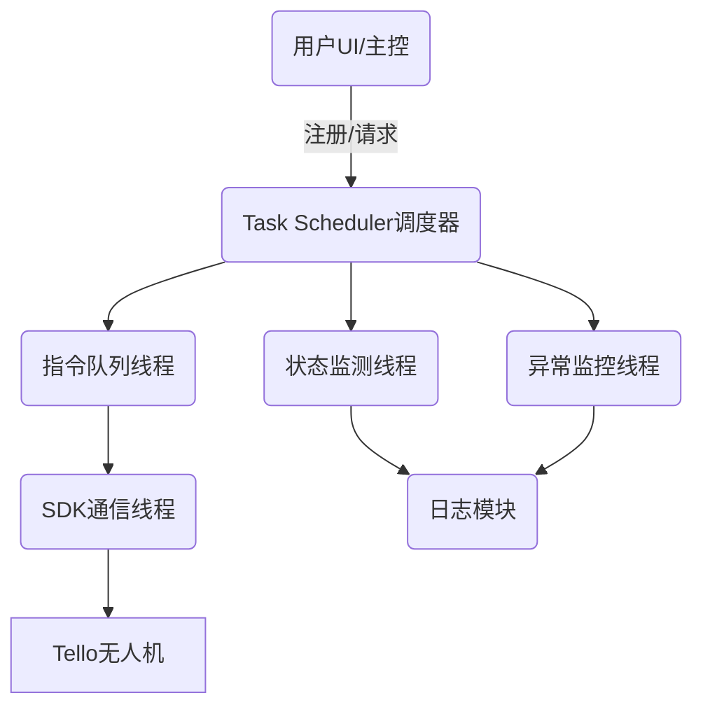
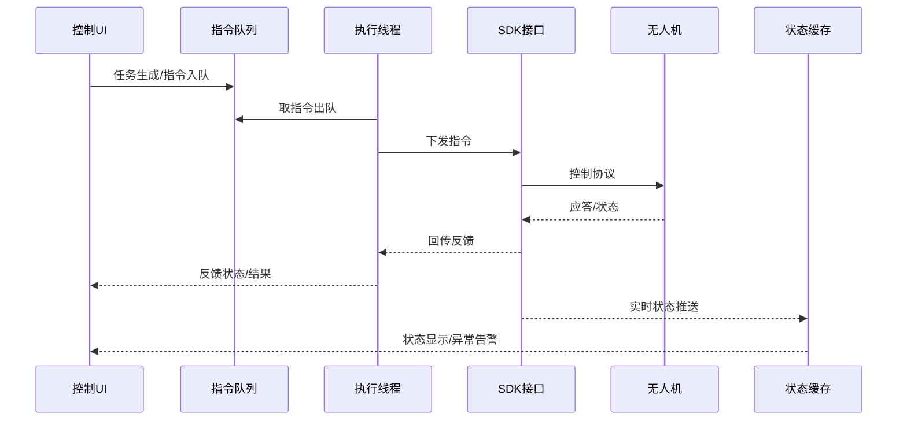
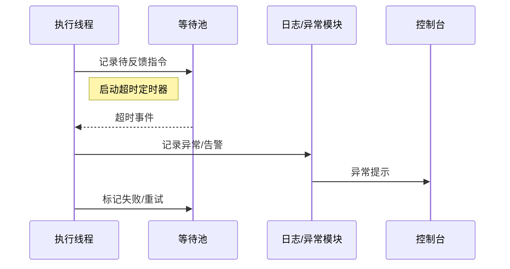
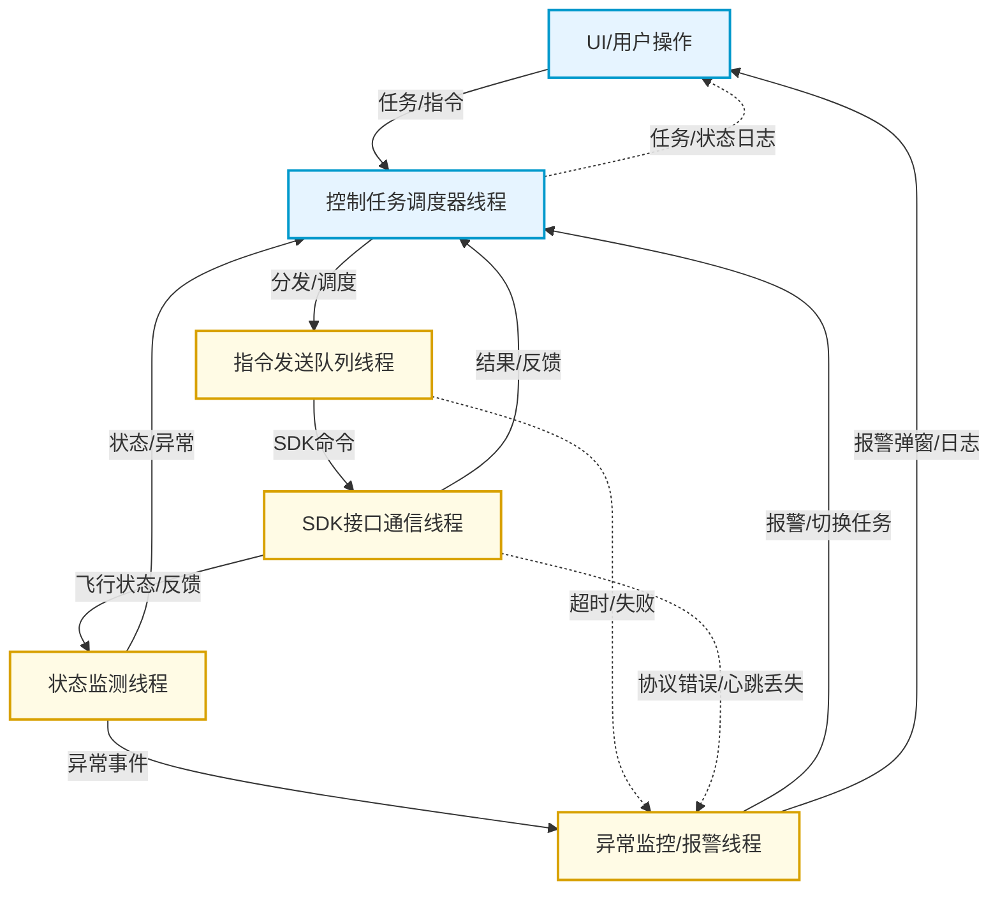
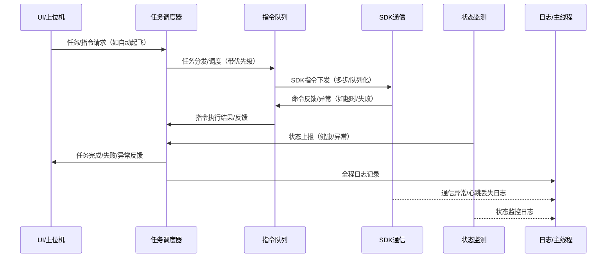
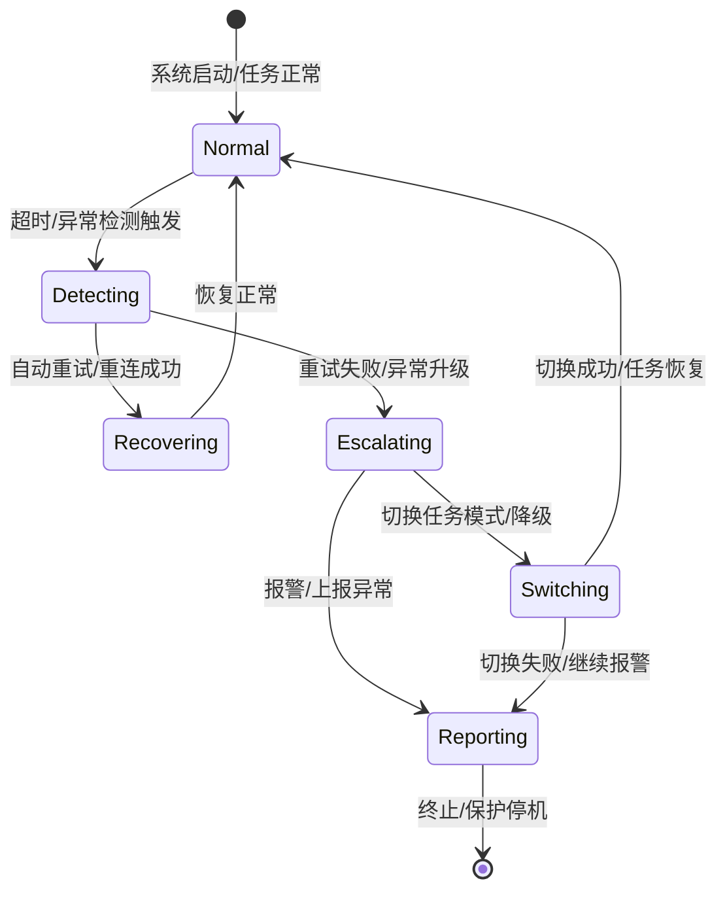
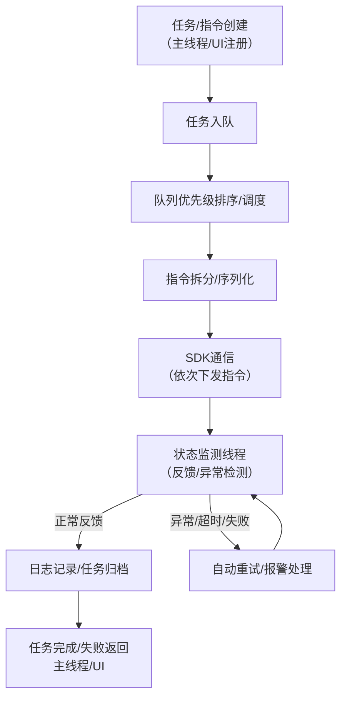
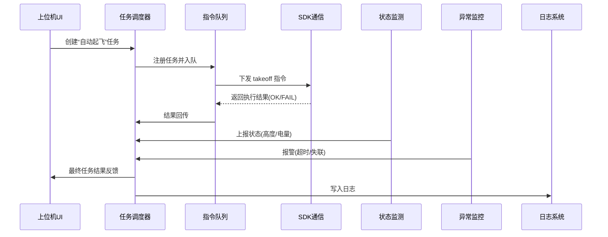
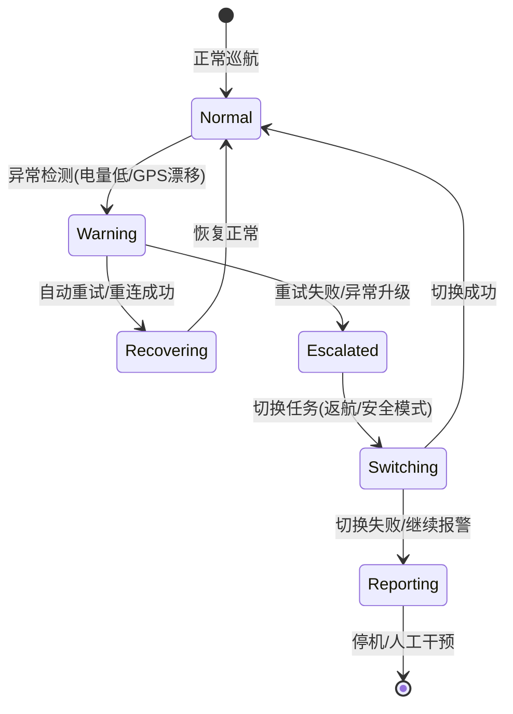
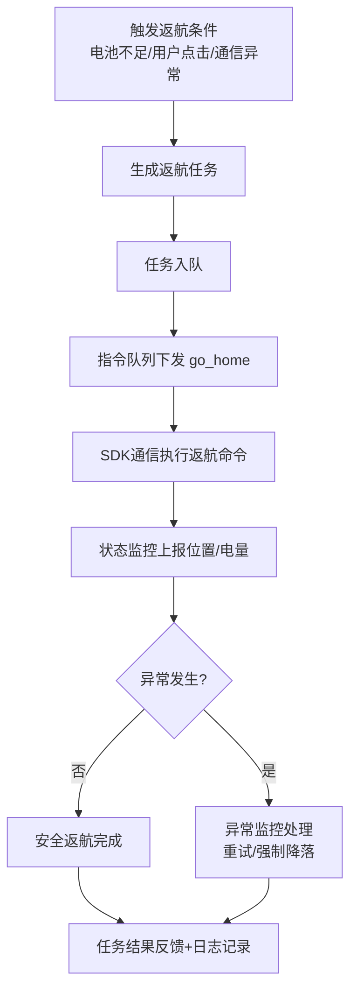

# 无人机控制模块系统设计

## 1. 模块需求与设计目标

### 1.1 功能需求概述

- **任务调度与飞行控制**：实现无人机的自动/手动任务调度、路径规划与飞行控制，支持一键起飞、降落、暂停、恢复、巡检等操作。
- **指令下发与状态监控**：负责接收来自上层系统（PC/Web/云端/脚本）的飞行指令，转化为Tello SDK协议指令下发，并实时采集无人机飞行状态、任务进度等信息回传。
- **异常管理与任务反馈**：具备任务超时、指令执行失败、通信中断等异常检测与响应能力，确保任务可靠执行并提供状态/日志反馈。
- **模块化与可扩展**：模块应设计为松耦合，便于与AI识别、图像处理等其他模块协作，满足后续扩展新功能/新协议需求。

### 1.2 性能/安全/异常目标

- **实时性**：指令下发与状态反馈延迟 < 100ms，关键任务执行无明显卡顿。
- **可靠性**：任务调度、队列机制保证任务有序可控，支持异常自动重试/回退。
- **安全性**：指令执行前检测合法性，防止误操作/危险动作（如低电量强制降落）。
- **异常处理**：支持通信超时、指令失败、无人机失联等异常场景的自动检测和处理，保证系统整体稳定性。
- **日志追溯**：所有关键事件、异常均需有详细日志便于问题追踪和系统维护。

### 1.3 与主系统的角色定位

- **中控核心**：作为整个无人机系统的“调度与执行中心”，负责连接上层（用户界面/任务系统/AI模块）与底层（Tello SDK/硬件）的桥梁。
- **接口统一**：对外提供标准化API和消息接口，供其他模块调用和集成（如AI识别结果自动触发飞行动作）。
- **状态管理者**：负责全局任务和飞行状态的跟踪、异常上报与多线程任务协同，确保主系统可以实时掌控无人机状态和响应各类操作请求。

###### ChatGPT 说：

好的，下面是**第2章：功能架构与线程模型**的标准写法，**每一节都包含结构图+文字说明**，并结合你提到的“任务分层注册机制”。

------

## 2. 功能架构与线程模型

### 2.1 主要功能模块/子线程划分

本模块采用多线程/多任务调度架构，将复杂的控制与数据流转化为高内聚、低耦合的功能子模块（线程/协程），每个子模块专注于一类核心业务，统一由调度器注册和管理。

**典型线程/子模块划分如下：**

- **控制任务调度器（Task Scheduler）**：系统的“调度核心”，负责接收上层业务任务（如自动巡检、目标跟踪），按优先级注册/派发到各子线程，统一调度、挂起、恢复和取消，保障并发/实时性需求。采用注册表+任务队列机制，所有任务/子模块需在初始化阶段“注册”进调度内核，运行时由调度器统一管理与唤醒。
   *（即你提到的“任务分层注册机制”——**所有业务线程/模块都以注册表的形式被调度器统一管理，支持热插拔、任务切换、扩展等操作**）*
- **指令发送队列线程**：将上层/调度器生成的飞行指令，按队列顺序/优先级逐条下发至Tello SDK，支持指令缓存、重试、限流等功能，保障指令可靠交付。
- **SDK接口通信线程**：独立负责与Tello无人机（底层SDK）进行TCP/UDP通信，收发协议数据包，解析/上报状态，自动重连/异常恢复。
- **状态监测线程**：实时采集无人机传感器/状态（如电量、高度、GPS等），定期回传/上报到主系统，并监控异常指标。
- **异常监控与报警线程**：全局监听指令超时、失联、低电量等事件，遇到风险自动触发应急机制，并上报主系统/弹窗报警。




### 2.2 各线程/子模块职责

| 线程/模块         | 主要职责说明                                                 |
| ----------------- | ------------------------------------------------------------ |
| 控制任务调度器    | 统一接管各业务线程注册与调度，管理任务生命周期，支持自动/手动切换、任务优先级、资源分配、状态同步与日志跟踪。 |
| 指令发送队列线程  | 维护指令缓冲队列，按序/并发发送SDK指令，失败自动重试，防止指令丢失与无序执行。 |
| SDK接口通信线程   | 负责与无人机SDK的底层连接与协议解析，持续收发指令/状态，自动重连、协议容错、心跳维护。 |
| 状态监测线程      | 周期性读取无人机状态数据（电量/坐标/飞行状态等），推送到主线程/日志，并判定是否触发异常/报警。 |
| 异常监控/报警线程 | 监控所有线程/任务健康度，出现超时/失联/失败等事件主动上报/切换任务模式，触发报警，记录详细日志。 |

## 3. 主要数据结构与流程机制

### 3.1 控制指令队列/缓存机制

- **目的**：保证多任务、多线程下，指令有序、可靠下发，支持优先级/并发处理。
- **数据结构**：  
  - `CommandQueue`：线程安全队列（FIFO/优先级队列），用于缓存待下发的飞行控制指令。
  - `CommandItem`：包含指令内容、时间戳、任务ID、重试次数、超时状态等字段。
- **主要操作**：
  - 指令入队（由调度器或上层调用，任务触发/手动添加）
  - 指令出队（由执行线程定时/按事件触发下发至SDK）
  - 支持队列满/空、超时丢弃、优先级抢占等策略

### 3.2 状态信息采集/反馈机制

- **目的**：及时获取无人机运行状态，保障控制闭环，支持UI/日志等多方反馈。
- **数据结构**：  
  - `StateInfo`：状态数据结构，包含姿态、高度、电量、定位、异常标志等字段
  - `StatusBuffer`：状态环形缓冲区/最新状态缓存
- **流程机制**：
  - SDK回调或定时拉取无人机状态数据，解析后存入缓存区
  - 提供状态订阅/推送接口，供UI/日志模块/异常检测等调用

### 3.3 指令/反馈的同步与超时处理

- **目的**：确保每个控制指令都能收到对应的应答（ack/nack），实现同步/异步混合机制，防止指令丢失或死等。
- **数据结构**：
  - `PendingCmdMap`：字典结构，记录当前等待反馈的指令及其超时/重试信息
- **机制说明**：
  - 下发指令后，进入`PendingCmdMap`，设置超时定时器
  - 收到反馈后立即移除，反馈UI/上层；如超时未响应，自动重试或上报异常
  - 支持**异步消息订阅/事件回调**（如任务完成、异常上报）

### 3.4 任务超时/失败反馈处理流程

- **目的**：对任务执行异常（如无人机掉线、无响应、目标丢失）等情况及时反馈并采取补救措施。
- **数据结构/状态变量**：
  - `TaskStatus`：任务执行状态枚举/标志
  - `ErrorEventList`：异常事件队列/日志
- **处理流程**：
  - 检测到任务超时/指令失败后，立即触发异常处理（重试、回调、降级、告警等）
  - 日志记录，并通过UI/告警接口通知用户
  - 如遇连续失败/严重故障，进入应急模式（返航/降落/停止任务等）

### 3.5 关键数据流

#### 3.5.1 控制指令/状态反馈主链路



#### 3.5.2 任务超时/异常处理链路



## 4 输入-处理-异常设计



## 5 对外接口与模块间通信

### 5.1 与主线程/调度器的通信协议

#### 5.1.1 通信机制

- 控制任务调度器作为核心调度中心，负责所有业务线程/模块的注册、调度与状态同步。
- 采用**消息队列+回调接口**机制，每个业务线程在初始化时向调度器注册，调度器根据任务优先级进行分发和资源调度。

#### 5.1.2 API接口与消息协议

**接口示例：**

```c
// 任务注册接口
int register_task_thread(task_id, thread_handle, priority);

// 任务状态上报
int report_task_status(task_id, status, timestamp, error_code);

// 分发指令到业务线程
int dispatch_command(task_id, cmd_type, param_struct *params);
```

**消息结构体示例:**

```c
typedef struct {
    int     msg_type;      // 消息类型（命令、状态、异常等）
    int     src_thread;    // 源线程/模块
    int     dest_thread;   // 目标线程/模块
    void*   payload;       // 消息内容
    size_t  payload_len;
    uint64_t timestamp;
} ctrl_msg_t;
```

### 5.1.3 数据格式与示例

**命令下发样例（JSON格式）：**

```c
{
  "cmd": "TAKEOFF",
  "target": "drone_main",
  "param": {
      "altitude": 1.5,
      "speed": 0.7
  },
  "timestamp": 1724172381
}
```

**状态上报样例：**

```c
{
  "thread": "state_monitor",
  "status": "OK",
  "battery": 87,
  "position": {"lat": 32.345, "lon": 119.421},
  "timestamp": 1724172410
}
```

### 5.2 与SDK底层的通信/调用方式

### 5.2.1 调用模式

- SDK接口通信线程专门负责底层SDK（如Tello无人机SDK）协议解析与命令收发，保持与飞控/无人机的持续连接。

- 所有与SDK相关的消息/指令均通过本线程转发，避免多线程争用。

### 5.2.2 SDK接口与数据结构

**典型SDK接口（伪代码）：**

```c
int sdk_connect(drone_ip, port);
int sdk_send_command(cmd, param_struct *params);
int sdk_receive_response(response_struct *resp, int timeout);
int sdk_disconnect();
```

**SDK命令结构举例：**

```c
{
  "cmd": "rc",
  "param": [0, 30, 0, 0]   // 例如控制前进
}
```

**状态/事件解析结构：**

```c
{
  "event": "BATTERY",
  "value": 92
}
```

### 5.2.3 调用流程与时序

- 指令队列线程将任务/指令通过消息队列转交给SDK接口通信线程；

- SDK接口通信线程负责协议封包、异常自动重连/心跳、结果解析；

- 状态和反馈通过消息队列/回调上报主线程。

### 5.3 与其他业务线程/模块的数据/消息交互点

#### 5.3.1 通信机制

- 业务线程间采用**消息队列/事件发布-订阅机制**，例如状态监测线程周期性推送状态消息到主线程、异常监控线程订阅所有异常事件。

#### 5.3.2 交互接口与消息定义

- 典型事件/数据结构：

```c
typedef struct {
    int     event_type;     // 事件类型：如 BATTERY_LOW、CONNECTION_LOST
    char    source[16];     // 事件来源线程
    int     value;          // 事件值（如电量、错误码等）
    uint64_t timestamp;
} event_msg_t;
```

- 主要接口/API（伪代码）：

```c
int publish_event(event_msg_t *evt);
int subscribe_event(int event_type, event_callback_t cb);
```

#### 5.3.3 时序与流程图

- 状态监测线程 → 状态异常/正常 → 异常监控线程 → 报警/切换任务
- 各线程间均可通过事件订阅机制感知并处理异常

#### 5.3.4 代码与消息样例

- 异常事件上报

```
{
  "event": "CONNECTION_LOST",
  "source": "sdk_comm",
  "timestamp": 1724172655,
  "error_code": 105
}
```

- 日志/健康上报样例

```
{
  "thread": "exception_monitor",
  "health": "FAILED",
  "reason": "heartbeat timeout"
}
```

## 6 典型时序与状态机图

### 6.1 任务调度/执行主时序

#### 6.1.1 总体描述

- 本节描述控制任务调度器主线程（或核心调度模块）在系统启动、任务注册、调度分发、资源回收等生命周期中的**典型执行流程**。

#### 6.1.2 时序图结构模板



### 6.2 异常处理状态机/流程图



**Normal（正常）**：系统运行无异常，周期性自检

**Detecting（异常检测）**：发现超时/失联/数据异常，进入检测/重试阶段

**Recovering（自动恢复）**：重试/自动重连成功则回归正常

**Escalating（异常分级）**：多次重试失败/异常加重，提升至高级别处理

**Switching（切换/降级）**：尝试切换任务、降级/返航/保护等

**Reporting（上报报警）**：切换/恢复均失败，报警并上报主线程/异常线程，记录日志，进入保护/终止状态

### 6.3 队列调度与反馈完整流程



## 7 可扩展性与维护性设计

### 7.1 线程扩展、任务扩展、异常自定义等

### 7.1.1 线程扩展

**设计思路**：

- 系统采用模块化/线程注册机制，每个新线程只需实现标准接口并注册到任务调度器，无需修改主流程。
- 支持**多线程并行**，每个线程有独立的生命周期管理、调度策略和资源分配。
- 线程类型可覆盖：数据采集、控制命令、状态监测、异常报警、业务处理、通信等。

**扩展流程**：

1. 新建业务线程，实现标准线程初始化/退出/调度接口（如`thread_init()`、`thread_run()`、`thread_exit()`）。
2. 通过注册API（如`register_thread(thread_handle, type, priority)`）加入调度中心。
3. 调度器动态分配资源，管理线程生命周期。
4. 线程可动态添加/卸载，无需重启主程序。

**示例代码片段：**

```c
// 线程注册接口
int register_thread(thread_handle_t *handle, thread_type_t type, int priority);

```

### 7.1.2 任务扩展

**设计思路**：

- 支持新业务/新场景任务的动态注册和分发，任务结构和协议支持可插拔/可扩展。
- 任务类型如：巡检、定点拍照、智能返航、多机协同等。
- 新任务通过注册API加入，队列和调度策略自动适配。

**扩展流程**：

1. 定义新任务类型及其参数结构（如`task_type`, `task_param`）。
2. 注册到任务管理/调度中心（如`register_task_type(task_type, handler_func)`）。
3. 系统自动支持新任务的分发、调度、异常处理、日志记录。

**示例代码片段：**

```c
typedef struct {
    int type;    // 任务类型
    void* param; // 任务参数
} task_t;

// 任务注册
int register_task_type(int type, int (*handler)(task_t*));

```

### 7.1.3 异常自定义与扩展

**设计思路**：

- 系统异常分为内置异常（如超时、失联、硬件故障）和**自定义异常**（如业务流程、传感器异常、策略触发等）。
- 支持动态添加/移除异常类型及对应处理逻辑。
- 异常处理可配置报警方式、自动恢复、降级或任务切换。

**扩展流程**：

1. 新增自定义异常类型及异常码（如`#define ERR_GPS_DRIFT  1201`）。
2. 通过异常处理注册接口（如`register_exception_handler(type, handler_func)`）添加处理逻辑。
3. 系统在运行时可动态启用/关闭、升级自定义异常，无需重启。
4. 异常上报和日志自动适配扩展字段。

**示例代码片段：**

```c
// 异常处理器注册
int register_exception_handler(int err_code, int (*handler)(exception_t*));

```

### 7.1.4 模块/协议扩展与升级

**要点**：

- 所有线程、任务、异常的注册、扩展都通过统一的模块管理接口完成。
- 通信协议支持**新字段兼容**、**协议版本标识**，便于后期升级和灰度发布。
- 可通过配置文件/远程命令扩展模块、升级协议，不影响历史功能。

### 7.1.5 典型扩展场景示例

- 新增“图像识别任务”线程，注册后主线程自动分配资源，无需停机。
- 新增“高温报警”异常类型，通过注册新处理逻辑，自动支持新报警模式。
- 任务协议升级，增加新参数“优先级等级”，老客户端兼容新协议自动忽略新增字段

### 7.2 配置参数自定义、重载与热插拔机制

### 7.2.1 配置参数自定义

**设计思路：**

- 系统所有关键参数（如任务调度策略、重试次数、超时时间、线程优先级、报警阈值等）均可**自定义配置**，支持在配置文件、命令行或上位机界面灵活设置。
- 支持**JSON/YAML/INI等主流配置格式**，便于跨平台和自动化管理。

**典型参数配置示例（JSON）：**

```
{
  "task_retry_limit": 3,
  "thread_priority": {
    "main": 10,
    "sdk": 8,
    "state_monitor": 6
  },
  "alarm_threshold": {
    "battery_low": 20,
    "temp_high": 75
  }
}
```

**要点说明：**

- 每项参数均支持默认值、范围校验和实时生效说明。
- 支持集中式和分布式配置管理，便于多端/多机批量升级。

------

### 7.2.2 参数重载/热加载

**设计思路：**

- 支持**运行时动态加载/重载**配置参数，无需系统重启。
- 参数变更可通过配置文件热加载、远程命令、上位机界面等方式完成，系统会实时同步并生效。
- 提供参数变更回滚/失败保护机制，保证系统安全稳定。

**实现要点：**

- 配置文件变更自动检测（如定时轮询或文件监听），变更时自动读取并更新内存参数。
- 参数热更新后，相关线程/模块自动收到更新通知并应用新值（如事件广播/回调）。
- 支持**参数版本管理**，便于回退和追溯。

**示例代码片段（伪代码）：**

```
void on_config_file_changed(const char* path) {
    reload_config();
    notify_modules_of_update();
}
```

------

### 7.2.3 模块热插拔机制

**设计思路：**

- 支持业务模块/线程**动态加载与卸载**，即插即用（如插件/模块热插拔机制）。
- 新模块只需实现标准接口并注册到模块管理器，无需修改主程序源码或重启系统。
- 支持模块升级、卸载、故障隔离和动态扩展，提升维护性和可用性。

**实现方式：**

- 基于模块管理器，支持`register_module()` / `unregister_module()`接口。
- 模块可独立部署、单独升级，出现异常可动态卸载隔离，系统其余部分不受影响。
- 插件式设计可通过动态链接库（如.so/.dll）或解释型脚本（如Python模块）实现。

**典型场景示例：**

- 新增“图像分析”业务插件，运行中加载即刻生效；如插件异常可随时卸载不影响主流程。
- 动态更换飞控通信协议，仅需热切换协议模块，无需重启主控或影响其他功能。

------

### 7.2.4 配置与插件管理工具建议

- 推荐集成统一配置管理界面/脚本工具，支持一键批量下发、变更、监控与回滚配置。
- 插件市场/仓库可支持一键安装、升级、下架业务模块。

------

### 7.2.5 工程亮点总结

- 参数、模块、协议均支持动态扩展和热插拔，极大提升了系统**可扩展性**和**运维效率**。
- 所有参数和模块变更均有日志、版本和安全保护，支撑大规模集成和长期维护。

### 7.3 单元测试/集成测试要点

### 7.3.1 单元测试设计

**目的**：确保每个核心模块、线程、接口的功能正确性与异常健壮性。

**主要内容**：

- 每个功能模块（如任务调度、指令队列、SDK通信、异常监控、状态采集等）均须有**独立单元测试用例**。
- 测试内容覆盖：**正常输入、边界条件、无效参数、异常分支、并发场景、资源回收**等。
- 推荐自动化测试框架（如 CMock、Unity、pytest、GoogleTest、Catch2 等，根据实际开发语言选用）。

**示例测试用例：**

- 任务调度器：注册任务、调度优先级正确性、异常任务处理。
- 指令队列：顺序出队、异常丢包、队满时溢出处理。
- SDK通信：指令发送、接收响应、超时重发、错误码解析。
- 异常监控：多种异常类型触发与上报、恢复与终止流程。

------

### 7.3.2 集成测试设计

**目的**：验证**系统级业务流程**在真实环境下的闭环能力与稳定性。

**主要内容**：

- **全链路测试**：模拟真实业务场景（如起飞-任务分发-指令执行-状态上报-异常重试-任务归档）全流程自动化测试。
- **模块间接口与协议兼容性测试**：不同版本/配置/插件组合下的兼容与健壮性。
- **高并发与压力测试**：多线程/多任务并发调度与极限负载下的正确性与性能。
- **异常场景覆盖**：如断电/失联/通信异常/模块崩溃等极端情况的自愈、恢复、日志追溯能力。

**示例测试场景**：

- 多任务同时下发，任务队列优先级切换及异常分支联动。
- SDK连接失效、重连与状态同步，系统是否平滑恢复。
- 动态参数/插件热加载过程中的稳定性和一致性。
- 日志、监控、报警端到端自动回归验证。

------

### 7.3.3 自动化与持续集成建议

- **自动化测试脚本**：建议为所有单元/集成测试编写自动化脚本，支持批量运行、结果自动统计与报警。
- **持续集成（CI）集成**：推荐接入 GitHub Actions、GitLab CI、Jenkins、Travis CI 等平台，自动拉起测试，保障代码主干质量。
- **测试覆盖率统计**：集成代码覆盖率工具，量化每个模块/分支的测试率，确保核心功能100%覆盖。

------

### 7.3.4 典型测试点清单（可填表格）

| 测试模块   | 主要测试点                     | 通过标准                   |
| ---------- | ------------------------------ | -------------------------- |
| 任务调度器 | 注册/销毁/优先级切换/异常处理  | 调度正确，异常可恢复       |
| 指令队列   | 入队/出队/溢出/丢包/顺序一致性 | 无丢失，无死锁，顺序正确   |
| SDK通信    | 下发/响应/超时/错误处理        | 成功率高，超时重发正确     |
| 状态监控   | 正常/异常状态采集/上报/报警    | 实时上报，异常及时报警     |
| 插件热插拔 | 动态加载/卸载/配置一致性       | 插件生效，无异常影响主流程 |
| 日志与监控 | 日志记录/异常回溯/报警推送     | 日志完备，报警全链路通知   |

------

### 7.3.5 工程亮点建议

- 强制单元+集成测试闭环，提升系统可靠性。
- 覆盖自动化、并发、异常分支和自愈，保证大规模扩展和长期维护。
- 测试用例和脚本可复用于交付验收、迭代升级和团队协作。

## 8 日志、监控与调试接口

### 8.1 日志结构与采集点说明

### 8.1.1 日志设计原则

- **统一格式**：全系统采用统一的日志结构，便于检索、分析和追溯。
- **多级日志级别**：支持DEBUG、INFO、WARN、ERROR、FATAL等分级，方便按需筛选和聚合。
- **可配置性**：日志输出级别、内容和目标（本地文件、远程服务器、串口等）可灵活配置。
- **高性能/异步写入**：采用环形缓冲、批量写入、异步落盘等机制，降低系统性能影响。

### 8.1.2 日志字段与结构

| 字段      | 类型     | 说明                      |
| --------- | -------- | ------------------------- |
| timestamp | int64    | 日志时间戳（ms/秒）       |
| module    | string   | 所属模块/线程名           |
| level     | string   | 日志级别（DEBUG/ERROR等） |
| event     | string   | 事件名或类型              |
| desc      | string   | 详细描述/上下文信息       |
| code      | int      | 错误码/事件码             |
| data      | json/obj | 相关参数/业务数据（可选） |

**示例日志（JSON）：**

```
{
  "timestamp": 1724173541,
  "module": "sdk_comm",
  "level": "ERROR",
  "event": "TIMEOUT",
  "desc": "SDK response timeout after 1500ms",
  "code": 504,
  "data": {
      "cmd": "takeoff",
      "retry_count": 2
  }
}
```

### 8.1.3 日志采集点与记录时机

- **系统启动/关闭**：启动参数、版本、异常关机等
- **线程/模块初始化与销毁**：线程上线/下线、资源分配回收
- **任务创建/分发/执行/完成**：队列入队、任务分配、状态变更、异常退出
- **指令下发与反馈**：命令、响应、超时、错误码
- **状态监控与报警**：电量、温度、信号丢失、恢复等
- **异常/报警/自愈**：所有关键异常和自愈操作过程，报警推送结果
- **配置变更/模块热插拔**：参数热加载、插件加载/卸载等

### 8.2 监控项与告警机制

### 8.2.1 系统监控项

- **线程/进程健康**：存活、卡死、异常退出、CPU/RAM占用
- **任务执行状态**：等待、执行中、完成、失败、重试次数
- **指令/SDK通信**：下发次数、响应延迟、丢包率、重连次数
- **设备运行指标**：电池/供电电压、温度、定位信号、传感器状态等
- **网络与接口**：丢包率、延迟、断连统计

### 8.2.2 告警策略与触发机制

- **监控阈值配置**：各项指标支持阈值配置，超限自动触发报警。
  - 如电量<20%、线程丢失心跳>3次、温度>75℃等
- **多级报警**：
  - **本地报警**：弹窗、蜂鸣、LED指示
  - **远程报警**：上位机推送、邮件/SMS/微信、日志服务器等
- **告警自愈与联动**：
  - 关键异常触发后自动执行自愈流程（如重启线程、任务降级、返航/保护模式）
  - 报警同时生成详细日志和报警工单，方便后续追溯

**报警日志示例：**

```
{
  "timestamp": 1724173610,
  "module": "alarm",
  "level": "WARN",
  "event": "BATTERY_LOW",
  "desc": "Battery dropped below 15%",
  "code": 210,
  "data": {
      "voltage": 10.4,
      "remain": 14.8
  }
}
```

### 8.3 调试与故障定位建议

### 8.3.1 调试接口设计

- **在线调试命令**：预留串口/网络调试口，支持在线下发调试命令、修改参数、手动触发流程
- **远程日志查看与追踪**：支持远程实时获取系统日志，便于多端联合调试
- **状态快照导出**：支持关键时刻导出系统状态/数据包/任务队列快照

### 8.3.2 故障定位方法

- **关键路径日志+trace**：所有重要节点有日志trace，便于定位出错位置和前后因果
- **异常事件回溯**：支持按时间/模块/事件码回溯全部异常与处理过程
- **与状态机/时序图联动**：结合状态机/流程图分析异常走向，精准定位根因
- **自动回放/复现工具**：建议开发异常复现脚本、自动回放功能，提升debug效率

### 8.3.3 辅助工具与平台

- **在线监控/可视化平台**：如web dashboard、Grafana、Prometheus、定制可视化界面等
- **自动报警/推送平台**：如钉钉/微信机器人、短信、邮件平台
- **脚本调试/日志分析工具**：自研或开源（如logparser、ELK stack）

------

### 8.3.4 故障定位/调试建议清单

- 发生复杂故障时，先**收集完整日志和报警链路**，结合时序图和状态机查找卡点
- 建议留有**断点/打印/状态快照**接口，便于多轮深入分析
- 对反复难复现bug，优先考虑**自动复现脚本和日志采集全程上报**
- 日志/报警要与**每个任务、线程、模块、业务事件**一一对应，方便定位与统计

------

### 8.3.5 工程亮点与扩展

- 强化了系统“可观测性”（Observability），极大降低了运维和现场调试难度
- 调试与日志接口可平滑对接云端监控和自动报警平台
- 支持远程维护、自动分析、批量问题定位，是高可维护性系统的核心基础

## 9 典型业务流程设计

### 9.1 自动起飞流程

#### 9.1.1 流程说明

1. **UI操作**：用户通过上位机点击“自动起飞”，触发任务请求。
2. **任务调度器**：接收请求，校验参数（目标高度、速度），生成任务描述。
3. **任务入队**：起飞任务被放入指令队列，等待分发。
4. **指令拆解与发送**：指令队列线程将“起飞任务”映射为SDK命令：`takeoff`。
5. **SDK通信**：SDK接口线程下发命令，并等待无人机响应。
6. **状态监测**：状态监控线程周期性读取飞行状态（电量、坐标、高度），实时上报主线程。
7. **异常监控**：若出现超时/失联/指令失败，异常监控线程触发重试或报警。
8. **日志记录与反馈**：任务结果写入日志，反馈给UI；若失败则返回错误码和异常详情。

#### 9.1.2 时序图



### 9.2 巡航中异常处理流程

#### 9.2.1 流程说明

1. **任务执行**：无人机在执行巡航任务，状态监测线程实时采集位置、航点、电池等数据。
2. **异常触发**：监测线程发现异常（如电池过低、GPS信号漂移、通信中断）。
3. **异常上报**：监测线程将异常事件发送至主线程，异常监控线程同步接收。
4. **异常分级**：异常监控线程判断异常等级（可恢复/严重），决定下一步动作。
5. **自动处理**：
   - 可恢复异常：触发重试（如重发指令、重连SDK）。
   - 严重异常：触发报警（UI提示、电量不足→准备返航）。
6. **任务调整**：若任务需切换（如“巡航→返航”），任务调度器修改任务状态，并将返航任务推入队列。
7. **日志与反馈**：异常过程与处理措施记录到日志，并反馈给用户。

#### 9.2.2 状态机图



### 9.3 自动返航流程

#### 9.3.1 流程说明

1. **触发返航条件**：可能由用户点击返航按钮、电池不足阈值触发、通信中断后自动返航。
2. **任务调度器**：生成返航任务，入队。
3. **指令下发**：指令队列线程将返航任务拆解为`go_home`等SDK命令，下发至无人机。
4. **状态监测**：状态线程持续监测无人机位置、电量，实时上报。
5. **异常监控**：若返航途中失联/超时/执行失败，触发报警与降级措施（如强制降落）。
6. **任务完成**：无人机安全返航至起点/预设航点，任务调度器反馈成功。
7. **日志记录**：返航过程与异常均写入日志。

#### 9.3.2 流程图 




