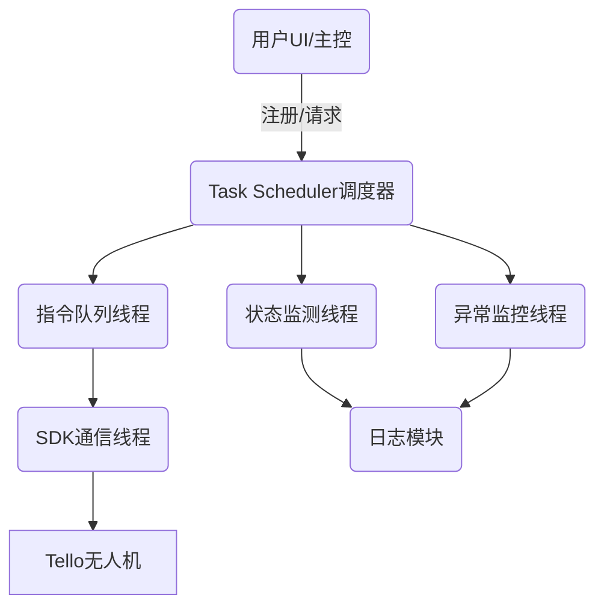
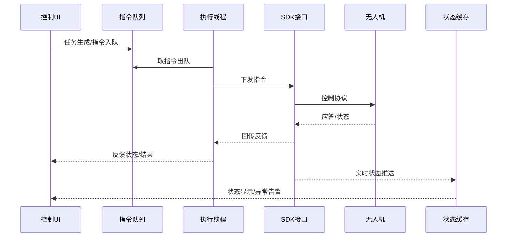
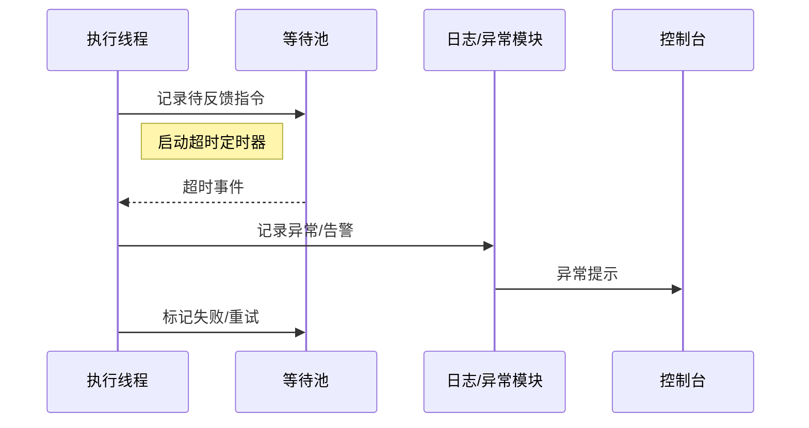
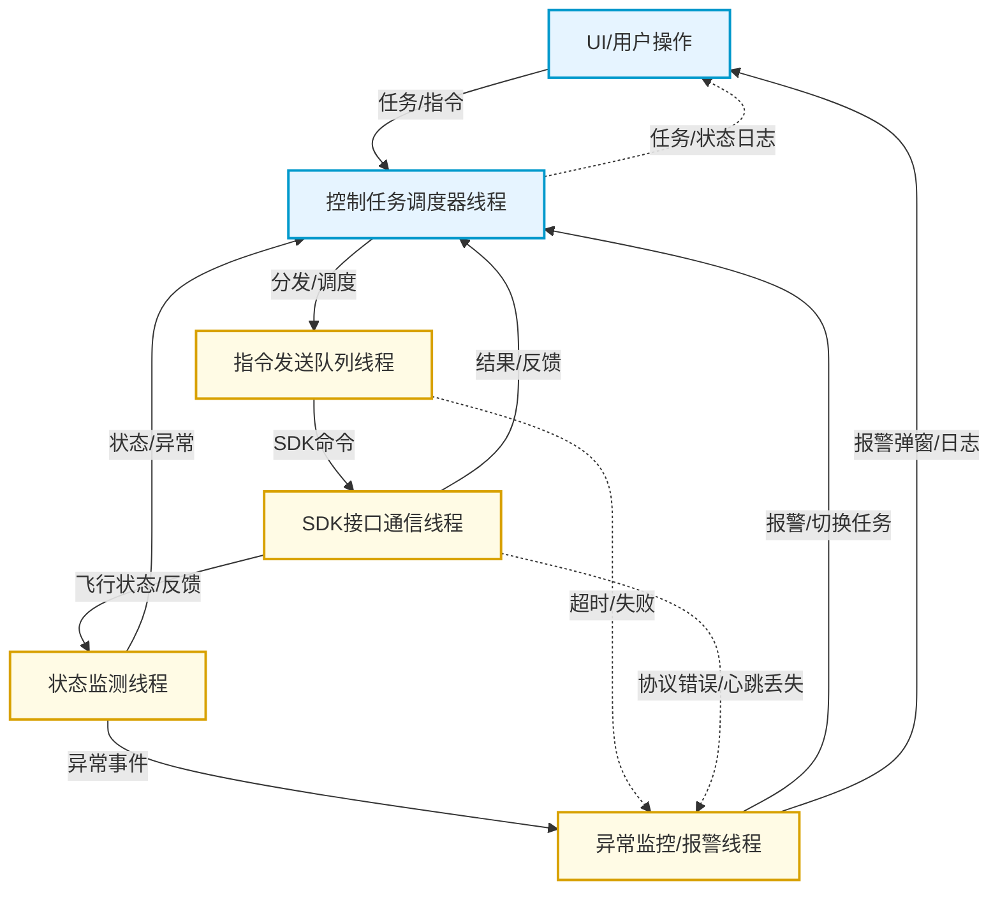
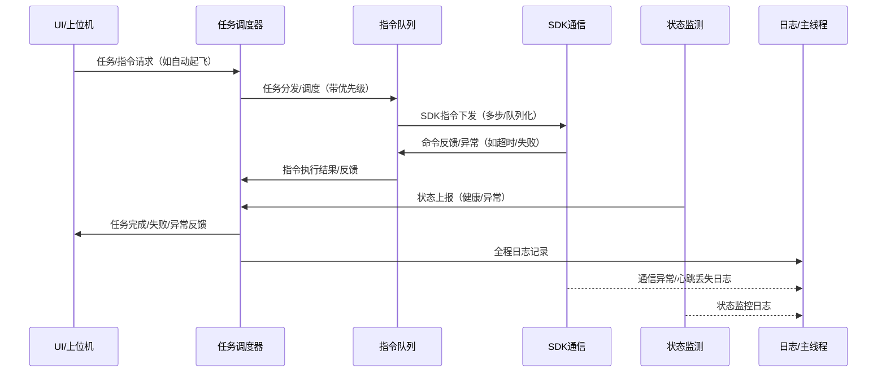
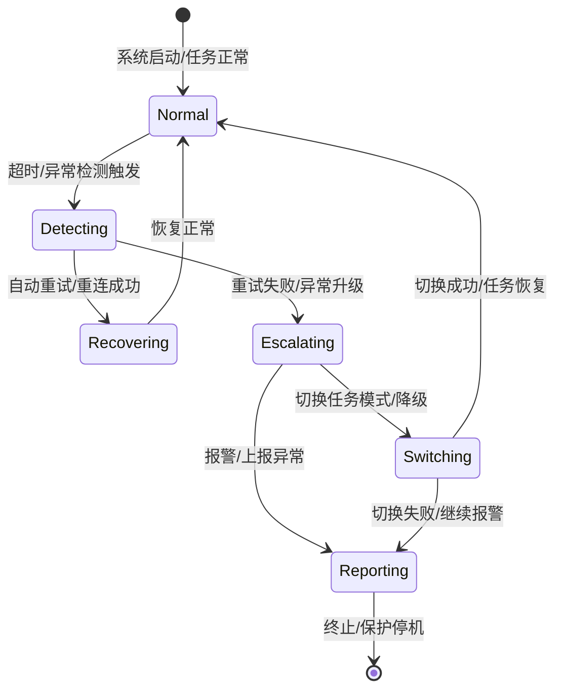

# 无人机控制模块系统设计

## 1. 模块需求与设计目标

### 1.1 功能需求概述

- **任务调度与飞行控制**：实现无人机的自动/手动任务调度、路径规划与飞行控制，支持一键起飞、降落、暂停、恢复、巡检等操作。
- **指令下发与状态监控**：负责接收来自上层系统（PC/Web/云端/脚本）的飞行指令，转化为Tello SDK协议指令下发，并实时采集无人机飞行状态、任务进度等信息回传。
- **异常管理与任务反馈**：具备任务超时、指令执行失败、通信中断等异常检测与响应能力，确保任务可靠执行并提供状态/日志反馈。
- **模块化与可扩展**：模块应设计为松耦合，便于与AI识别、图像处理等其他模块协作，满足后续扩展新功能/新协议需求。

### 1.2 性能/安全/异常目标

- **实时性**：指令下发与状态反馈延迟 < 100ms，关键任务执行无明显卡顿。
- **可靠性**：任务调度、队列机制保证任务有序可控，支持异常自动重试/回退。
- **安全性**：指令执行前检测合法性，防止误操作/危险动作（如低电量强制降落）。
- **异常处理**：支持通信超时、指令失败、无人机失联等异常场景的自动检测和处理，保证系统整体稳定性。
- **日志追溯**：所有关键事件、异常均需有详细日志便于问题追踪和系统维护。

### 1.3 与主系统的角色定位

- **中控核心**：作为整个无人机系统的“调度与执行中心”，负责连接上层（用户界面/任务系统/AI模块）与底层（Tello SDK/硬件）的桥梁。
- **接口统一**：对外提供标准化API和消息接口，供其他模块调用和集成（如AI识别结果自动触发飞行动作）。
- **状态管理者**：负责全局任务和飞行状态的跟踪、异常上报与多线程任务协同，确保主系统可以实时掌控无人机状态和响应各类操作请求。

###### ChatGPT 说：

好的，下面是**第2章：功能架构与线程模型**的标准写法，**每一节都包含结构图+文字说明**，并结合你提到的“任务分层注册机制”。

------

## 2. 功能架构与线程模型

### 2.1 主要功能模块/子线程划分

本模块采用多线程/多任务调度架构，将复杂的控制与数据流转化为高内聚、低耦合的功能子模块（线程/协程），每个子模块专注于一类核心业务，统一由调度器注册和管理。

**典型线程/子模块划分如下：**

- **控制任务调度器（Task Scheduler）**：系统的“调度核心”，负责接收上层业务任务（如自动巡检、目标跟踪），按优先级注册/派发到各子线程，统一调度、挂起、恢复和取消，保障并发/实时性需求。采用注册表+任务队列机制，所有任务/子模块需在初始化阶段“注册”进调度内核，运行时由调度器统一管理与唤醒。
   *（即你提到的“任务分层注册机制”——**所有业务线程/模块都以注册表的形式被调度器统一管理，支持热插拔、任务切换、扩展等操作**）*
- **指令发送队列线程**：将上层/调度器生成的飞行指令，按队列顺序/优先级逐条下发至Tello SDK，支持指令缓存、重试、限流等功能，保障指令可靠交付。
- **SDK接口通信线程**：独立负责与Tello无人机（底层SDK）进行TCP/UDP通信，收发协议数据包，解析/上报状态，自动重连/异常恢复。
- **状态监测线程**：实时采集无人机传感器/状态（如电量、高度、GPS等），定期回传/上报到主系统，并监控异常指标。
- **异常监控与报警线程**：全局监听指令超时、失联、低电量等事件，遇到风险自动触发应急机制，并上报主系统/弹窗报警。




### 2.2 各线程/子模块职责

| 线程/模块         | 主要职责说明                                                 |
| ----------------- | ------------------------------------------------------------ |
| 控制任务调度器    | 统一接管各业务线程注册与调度，管理任务生命周期，支持自动/手动切换、任务优先级、资源分配、状态同步与日志跟踪。 |
| 指令发送队列线程  | 维护指令缓冲队列，按序/并发发送SDK指令，失败自动重试，防止指令丢失与无序执行。 |
| SDK接口通信线程   | 负责与无人机SDK的底层连接与协议解析，持续收发指令/状态，自动重连、协议容错、心跳维护。 |
| 状态监测线程      | 周期性读取无人机状态数据（电量/坐标/飞行状态等），推送到主线程/日志，并判定是否触发异常/报警。 |
| 异常监控/报警线程 | 监控所有线程/任务健康度，出现超时/失联/失败等事件主动上报/切换任务模式，触发报警，记录详细日志。 |

## 3. 主要数据结构与流程机制

### 3.1 控制指令队列/缓存机制

- **目的**：保证多任务、多线程下，指令有序、可靠下发，支持优先级/并发处理。
- **数据结构**：  
  - `CommandQueue`：线程安全队列（FIFO/优先级队列），用于缓存待下发的飞行控制指令。
  - `CommandItem`：包含指令内容、时间戳、任务ID、重试次数、超时状态等字段。
- **主要操作**：
  - 指令入队（由调度器或上层调用，任务触发/手动添加）
  - 指令出队（由执行线程定时/按事件触发下发至SDK）
  - 支持队列满/空、超时丢弃、优先级抢占等策略

### 3.2 状态信息采集/反馈机制

- **目的**：及时获取无人机运行状态，保障控制闭环，支持UI/日志等多方反馈。
- **数据结构**：  
  - `StateInfo`：状态数据结构，包含姿态、高度、电量、定位、异常标志等字段
  - `StatusBuffer`：状态环形缓冲区/最新状态缓存
- **流程机制**：
  - SDK回调或定时拉取无人机状态数据，解析后存入缓存区
  - 提供状态订阅/推送接口，供UI/日志模块/异常检测等调用

### 3.3 指令/反馈的同步与超时处理

- **目的**：确保每个控制指令都能收到对应的应答（ack/nack），实现同步/异步混合机制，防止指令丢失或死等。
- **数据结构**：
  - `PendingCmdMap`：字典结构，记录当前等待反馈的指令及其超时/重试信息
- **机制说明**：
  - 下发指令后，进入`PendingCmdMap`，设置超时定时器
  - 收到反馈后立即移除，反馈UI/上层；如超时未响应，自动重试或上报异常
  - 支持**异步消息订阅/事件回调**（如任务完成、异常上报）

### 3.4 任务超时/失败反馈处理流程

- **目的**：对任务执行异常（如无人机掉线、无响应、目标丢失）等情况及时反馈并采取补救措施。
- **数据结构/状态变量**：
  - `TaskStatus`：任务执行状态枚举/标志
  - `ErrorEventList`：异常事件队列/日志
- **处理流程**：
  - 检测到任务超时/指令失败后，立即触发异常处理（重试、回调、降级、告警等）
  - 日志记录，并通过UI/告警接口通知用户
  - 如遇连续失败/严重故障，进入应急模式（返航/降落/停止任务等）

### 3.5 关键数据流

#### 3.5.1 控制指令/状态反馈主链路



#### 3.5.2 任务超时/异常处理链路



## 4 输入-处理-异常设计



## 5 对外接口与模块间通信

### 5.1 与主线程/调度器的通信协议

#### 5.1.1 通信机制

- 控制任务调度器作为核心调度中心，负责所有业务线程/模块的注册、调度与状态同步。
- 采用**消息队列+回调接口**机制，每个业务线程在初始化时向调度器注册，调度器根据任务优先级进行分发和资源调度。

#### 5.1.2 API接口与消息协议

**接口示例：**

```c
// 任务注册接口
int register_task_thread(task_id, thread_handle, priority);

// 任务状态上报
int report_task_status(task_id, status, timestamp, error_code);

// 分发指令到业务线程
int dispatch_command(task_id, cmd_type, param_struct *params);
```

**消息结构体示例:**

```c
typedef struct {
    int     msg_type;      // 消息类型（命令、状态、异常等）
    int     src_thread;    // 源线程/模块
    int     dest_thread;   // 目标线程/模块
    void*   payload;       // 消息内容
    size_t  payload_len;
    uint64_t timestamp;
} ctrl_msg_t;
```

### 5.1.3 数据格式与示例

**命令下发样例（JSON格式）：**

```c
{
  "cmd": "TAKEOFF",
  "target": "drone_main",
  "param": {
      "altitude": 1.5,
      "speed": 0.7
  },
  "timestamp": 1724172381
}
```

**状态上报样例：**

```c
{
  "thread": "state_monitor",
  "status": "OK",
  "battery": 87,
  "position": {"lat": 32.345, "lon": 119.421},
  "timestamp": 1724172410
}
```

### 5.2 与SDK底层的通信/调用方式

### 5.2.1 调用模式

- SDK接口通信线程专门负责底层SDK（如Tello无人机SDK）协议解析与命令收发，保持与飞控/无人机的持续连接。

- 所有与SDK相关的消息/指令均通过本线程转发，避免多线程争用。

### 5.2.2 SDK接口与数据结构

**典型SDK接口（伪代码）：**

```c
int sdk_connect(drone_ip, port);
int sdk_send_command(cmd, param_struct *params);
int sdk_receive_response(response_struct *resp, int timeout);
int sdk_disconnect();
```

**SDK命令结构举例：**

```c
{
  "cmd": "rc",
  "param": [0, 30, 0, 0]   // 例如控制前进
}
```

**状态/事件解析结构：**

```c
{
  "event": "BATTERY",
  "value": 92
}
```

### 5.2.3 调用流程与时序

- 指令队列线程将任务/指令通过消息队列转交给SDK接口通信线程；

- SDK接口通信线程负责协议封包、异常自动重连/心跳、结果解析；

- 状态和反馈通过消息队列/回调上报主线程。

### 5.3 与其他业务线程/模块的数据/消息交互点

#### 5.3.1 通信机制

- 业务线程间采用**消息队列/事件发布-订阅机制**，例如状态监测线程周期性推送状态消息到主线程、异常监控线程订阅所有异常事件。

#### 5.3.2 交互接口与消息定义

- 典型事件/数据结构：

```c
typedef struct {
    int     event_type;     // 事件类型：如 BATTERY_LOW、CONNECTION_LOST
    char    source[16];     // 事件来源线程
    int     value;          // 事件值（如电量、错误码等）
    uint64_t timestamp;
} event_msg_t;
```

- 主要接口/API（伪代码）：

```c
int publish_event(event_msg_t *evt);
int subscribe_event(int event_type, event_callback_t cb);
```

#### 5.3.3 时序与流程图

- 状态监测线程 → 状态异常/正常 → 异常监控线程 → 报警/切换任务
- 各线程间均可通过事件订阅机制感知并处理异常

#### 5.3.4 代码与消息样例

- 异常事件上报

```
{
  "event": "CONNECTION_LOST",
  "source": "sdk_comm",
  "timestamp": 1724172655,
  "error_code": 105
}
```

- 日志/健康上报样例

```
{
  "thread": "exception_monitor",
  "health": "FAILED",
  "reason": "heartbeat timeout"
}
```

## 6 典型时序与状态机图

### 6.1 任务调度/执行主时序

#### 6.1.1 总体描述

- 本节描述控制任务调度器主线程（或核心调度模块）在系统启动、任务注册、调度分发、资源回收等生命周期中的**典型执行流程**。

#### 6.1.2 时序图结构模板



### 6.2 异常处理状态机/流程图




### 6.3 队列调度与反馈完整流程


## 7 可扩展性与维护性设计

### 7.1 线程扩展、任务扩展、异常自定义等


### 7.2 配置参数自定义、重载与热插拔机制


### 7.3 单元测试/集成测试要点

## 8 日志、监控与调试接口

### 8.1 日志结构与采集点说明


### 8.2 监控项与告警机制


### 8.3 调试与故障定位建议

