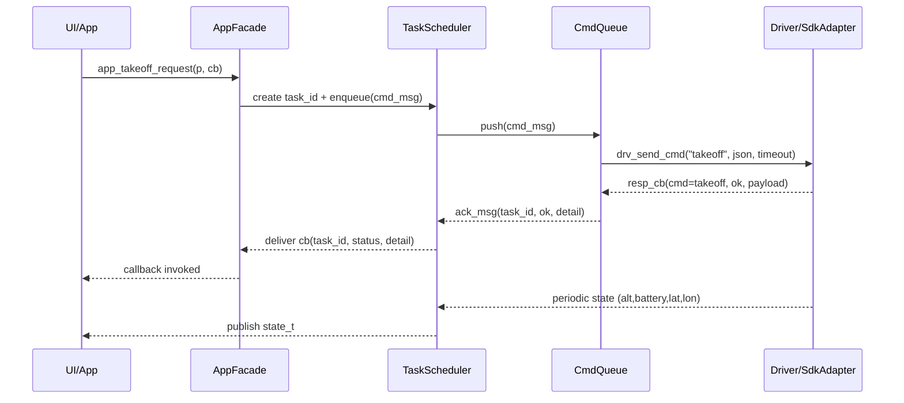

# 无人机控制模块详细设计

## 1 设计范围与目标

### 1.1 需要解决的主要问题与场景约束

（1）**目标闭环**：在 `app → middleware → driver` 三层结构下，实现“自动起飞”功能从请求到应答（ACK）、再到持续状态发布的最小可行闭环。

（2）**关键问题**：

- **时限保障**：命令下发与 ACK 应答必须具备超时与重试机制，避免任务阻塞。
- **状态可观测**：上层应用应能够订阅到周期性状态数据（`alt/battery/lat/lon`），并通过日志完整追踪 `task_id`。
- **异常自愈**：在连接中断或网络抖动情况下，系统需通过心跳检测、自动重连与事件上报实现自愈。
- **层间边界清晰**：应用层不得越级调用驱动层，接口、字段、错误码与时序均需在契约中明确规定。

（3）**场景约束与假设**：

- 假设设备可建立稳定连接（MVP 阶段允许使用桩/模拟驱动）。
- 本阶段仅覆盖“自动起飞”业务场景，巡航与返航将在后续阶段基于相同框架扩展。
- 层间数据交换统一采用 JSON 格式，新增字段需保持前向兼容。

### 1.2 设计范围界定与成功判定标准

（1）**范围界定**：

- 明确并固化两组接口契约：`App ⇄ Middleware` 与 `Middleware ⇄ Driver`，涵盖函数签名、参数字段、错误码与超时机制。
- 中间层需实现四个最小化组件：`AppFacade`、`TaskScheduler`、`CmdQueue`、`StateMonitor`，并由 `ExceptionManager` 统一管理异常。
- 驱动层需提供最小连接与通信能力：`connect / send_cmd / resp_cb / heartbeat / reconnect_if_needed`，允许桩实现。

（2）**成功判定标准**：

- 应用调用 `app_takeoff_request()` 后，在 **2 秒内**收到异步 ACK 回调（`status=0`）。
- 上层订阅接口能够以 **1 秒 ±10%** 的周期获取状态数据（`alt/battery/lat/lon`）。
- 在命令超时或连接断开时，系统能够触发事件上报并执行重试/重连，自愈机制生效。
- 日志中统一包含字段：`ts, module, level, event, task_id`，能够完整追踪任务链路。

（3）**不在范围的内容**：

- 避障、视觉感知、路径规划、地图/地理围栏、安全认证与加密等高级功能。

### 1.3 关键绩效指标（KPI）

**功能性指标**：

- 起飞命令的 ACK 延迟 **P95 ≤ 2 秒**；失败时返回统一错误码（非零）。
- 状态发布周期 **1 秒 ±10%**；状态丢失率 **< 1%**（模拟环境下）。

**健壮性指标**：

- 命令超时率 **< 1%**（MVP 测试环境）。
- 断链后的重连成功率 **> 95%**；心跳成功率 **> 99%**。

**可观测性指标**：

- 日志字段完整率 **= 100%**；关键事件（超时/重连）上报覆盖率 **= 100%**。
- 监控面板需涵盖：ACK 延迟、命令队列长度、超时率、心跳成功率等核心指标。

## 2 架构分层与线程模型设计

### 2.1 分层职责划分

- **应用层（App）**
  - 职责：编排业务用例（起飞/巡航/返航）并与 UI 对接。
  - 限制：仅依赖中间层提供的 API，不得直接调用驱动层或 SDK。
- **中间层（Middleware）**
  - 职责：任务调度、命令队列、状态监测、异常管理与事件分发。
  - 特点：对上提供异步 API，对下统一调用驱动层，保证线程安全与时序可控。
- **驱动层（Driver）**
  - 职责：适配 SDK 或设备协议，完成封包、通信、超时检测、心跳与重连。
  - 限制：不包含业务逻辑，仅保证“收发正确 + 错误码返回”。
- **依赖方向**
  - 单向依赖：`App → Middleware → Driver`。
  - 禁止越级调用，保证架构清晰、接口可控。

### 2.2 线程并发模型设计

- **核心线程/组件**
  - **TaskScheduler**：生成并管理 `task_id`，分发任务到命令队列，并负责超时计时。
  - **CmdQueue**：严格 FIFO 的单消费线程，保证命令顺序执行，避免竞态。
  - **StateMonitor**：定时执行心跳与状态获取，并将状态发布到事件总线。
  - **ExceptionManager**：统一处理超时/失联，触发重试与事件上报。
- **并发控制策略**
  - **命令下发**：采用串行化队列（MVP 阶段），确保飞行控制指令顺序可预测。
  - **回调执行**：采用异步触发机制，防止回调阻塞命令队列。
  - **超时计时**：基于单调时钟，避免系统时间漂移对逻辑的影响。
- **互斥与同步**
  - 命令执行与状态发布分属不同线程，互不阻塞。
  - 任务表与事件总线需采用线程安全容器或互斥锁。

### 2.3 设计约束与关键决策

- **Problem（问题）**
  - 是否允许命令并行下发？
  - 超时检测由调度器负责还是驱动层负责？
  - 状态发布采用推送还是拉取？
- **Decision（决策）**
  - **命令下发**：MVP 阶段采用全串行，后续可扩展优先级多队列。
  - **超时检测**：由中间层 `TaskScheduler` 统一负责，驱动层仅返回结果或错误。
  - **状态发布**：采用定时拉取 + 驱动心跳，统一由 `StateMonitor` 发布。
- **KPI（关键指标）**
  - 命令队列延迟：P95 ≤ 100 ms；队列长度 ≤ 128。
  - 回调平均响应时间 ≤ 50 ms，不阻塞队列线程。
  - 状态发布周期偏差 ≤ 10%。

## 3 核心数据模型与流程设计

### 3.1 数据结构定义

为保证跨层交互的一致性和可扩展性，本阶段定义以下四类核心数据模型：

- **命令消息（cmd_msg_t）**
  - 字段：`task_id`、`cmd`、`json_param`、`timeout_ms`
  - 说明：由调度器生成并推入命令队列，用于下发控制指令。
- **应答消息（ack_msg_t）**
  - 字段：`task_id`、`ok`、`detail`
  - 说明：由驱动层返回并回流至应用层，表征命令是否成功执行。
- **状态信息（state_t）**
  - 字段：`alt`、`battery`、`lat`、`lon`
  - 说明：由 `StateMonitor` 定时获取并发布，供上层订阅显示。
- **事件信息（event_t）**
  - 字段：`severity`、`name`、`json_ctx`
  - 说明：由 `ExceptionManager` 触发，用于报告异常、告警和恢复动作。

**设计约束**：

- 数据结构均通过 JSON 序列化跨层传递，新增字段必须保持前向兼容。
- 所有结构体必须包含可追踪字段（如 `task_id`），以支持日志链路追踪。

### 3.2 流程机制设计

根据起飞闭环的业务需求，建立以下三类数据流：

- **命令流（下行）**
  - App 调用 `app_takeoff_request()` 生成 `cmd_msg_t`；
  - TaskScheduler 分配 `task_id` 并推送至 CmdQueue；
  - CmdQueue 串行调用 Driver 层 `drv_send_cmd()`；
  - Driver 层返回 `ack_msg_t`，通过回调回流至上层。
- **状态流（上行）**
  - Driver/SDK 周期性提供状态数据；
  - StateMonitor 拉取或接收后构造 `state_t`；
  - 通过事件总线发布给所有订阅者。
- **异常流（上行）**
  - 由 Scheduler、CmdQueue 或 StateMonitor 检测到异常（如超时、失联）；
  - ExceptionManager 生成 `event_t`；
  - 上报至订阅者并触发自愈逻辑。

### 3.3 背压与重试策略

为确保系统在高负载或异常情况下的稳定性，制定以下机制：

- **队列与背压**
  - CmdQueue 采用严格 FIFO；
  - 当队列长度超过 `ctrl.queue.max_len` 时，返回 `ERR_QUEUE_FULL`；
  - 上层可选择退避或丢弃策略。
- **重试与退避**
  - 对于命令超时，默认重试 2 次，每次间隔 200 ms（可配置）；
  - 重试失败后生成 `event_t` 上报，任务标记失败。
- **幂等性**
  - 重复 task_id 的请求不予执行，避免重复操作；
  - 后续可引入“命令幂等性标志”字段支持更复杂场景。

**KPI 指标**：

- 队列长度 ≤ 128，超限报警；
- 命令超时率 < 1%；
- 重试成功率 ≥ 95%；
- 状态发布丢失率 < 1%。

## 4 输入处理与异常策略

### 4.1 应用层（App）

- **输入处理**
  - 接收用户或上层脚本调用 `app_takeoff_request(p, cb)`。
  - 参数校验：
    - `altitude_m` 必须 >0 且 ≤5.0 m（MVP 范围）。
    - `speed_mps` 必须 >0 且 ≤2.0 m/s。
    - 回调指针 `cb` 必须非空。
  - 不合规参数 → 返回 `ERR_INVALID_ARG`，不进入命令队列。
- **异常策略**
  - 参数错误：立即同步返回错误，不触发异步回调。
  - 上下层通信失败（如队列满）：通过回调返回 `ERR_QUEUE_FULL` 并提示重试。

### 4.2 中间层（Middleware）

- **输入处理**
  - **TaskScheduler**：生成唯一 `task_id`，启动超时计时器，将 `cmd_msg_t` 投递到命令队列。
  - **CmdQueue**：严格 FIFO 出队，调用 `drv_send_cmd()`。
  - **StateMonitor**：周期执行心跳与状态采集，封装为 `state_t` 并发布。
- **异常策略**
  - **命令超时**：
    - 在 `timeout_ms` 内未收到 ACK → 调用回调返回 `ERR_TIMEOUT`；
    - 触发 `event_t` 上报；
    - 默认重试 2 次，每次间隔 200 ms。
  - **队列溢出**：
    - 当队列长度超过上限 → 返回 `ERR_QUEUE_FULL`；
    - 拒绝新任务并上报事件。
  - **心跳失效**：
    - 连续 N 次心跳失败（MVP 默认 3 次） → 调用 `drv_reconnect_if_needed()`；
    - 若重连成功 → 发布 INFO 级事件；若失败 → 发布 CRITICAL 事件。
  - **状态丢失**：
    - 超过 2 个周期未发布状态 → 发布 WARN 事件，提示数据异常。

### 4.3 驱动层（Driver）

- **输入处理**
  - 接收 `drv_send_cmd(cmd, json_param, timeout_ms)`；
  - 执行命令封包与下发；
  - 在约定时限内等待应答或错误反馈。
- **异常策略**
  - **未连接**：
    - 若连接状态无效 → 返回 `ERR_NOT_CONNECTED`；
    - 同时触发重连逻辑。
  - **IO 异常**：
    - SDK/网络错误 → 返回 `ERR_SDK_IO`；
    - 事件上报，由中间层决定是否重试。
  - **重连失败**：
    - 多次尝试仍无法建立连接 → 返回 CRITICAL 事件，交由上层处理。

## 5 接口契约与通信规范

### 5.1 应用层与中间层接口契约（App ⇄ Middleware）

**功能定位**

- 提供业务用例级别的异步 API。
- 保证应用层与 SDK 的完全解耦，应用只依赖中间层的稳定接口。

**接口清单**

1. `const char* app_takeoff_request(const takeoff_param_t* p, task_cb_t cb)`
   - 输入：`takeoff_param_t { altitude_m: float; speed_mps: float }`
   - 输出：返回 `task_id`（生命周期由中间层管理）。
   - 行为：生成任务并异步执行，结果通过回调 `task_cb_t` 返回。
2. `int app_subscribe_state(state_cb_t cb)`
   - 输入：回调函数指针 `state_cb_t`。
   - 行为：订阅周期状态（JSON 格式），周期默认 1s。
   - 返回：0 成功，非 0 失败。
3. `int app_subscribe_event(event_cb_t cb)`
   - 输入：回调函数指针 `event_cb_t`。
   - 行为：订阅异常事件（JSON 格式）。
   - 返回：0 成功，非 0 失败。

**契约约束**

- API 调用必须异步，不得阻塞调用线程。
- 回调触发不得超过超时阈值（默认 2s）。
- 错误码统一来源于 `errors.h`，保持全局一致性。

### 5.2 中间层与驱动层接口契约（Middleware ⇄ Driver）

**功能定位**

- 提供底层通信能力，包括命令下发、应答接收、心跳与重连。
- 保证中间层不感知具体 SDK 实现细节。

**接口清单**

1. `int drv_connect(const char* ip, int port)`
   - 建立与设备的连接。
2. `int drv_send_cmd(const char* cmd, const char* json_param, int timeout_ms)`
   - 输入：命令字符串、JSON 参数、超时时间。
   - 输出：0 成功提交，非 0 错误。
   - 行为：异步下发命令，等待驱动层回调。
3. `int drv_set_resp_callback(drv_resp_cb_t cb)`
   - 注册命令应答回调函数。
4. `int drv_heartbeat()`
   - 执行一次心跳检测，返回 0 表示成功。
5. `int drv_reconnect_if_needed()`
   - 若连接中断，则尝试重连。

**契约约束**

- 命令必须串行执行；驱动层负责封包与网络传输。
- 应答回调 `drv_resp_cb_t(const char* cmd, int ok, const char* payload)`
  - `ok=1` 表示成功，`ok=0` 表示失败。
  - `payload` 为 JSON 格式，包含 ACK 或错误详情。
- 驱动层返回的所有错误码需映射为统一错误码表。

### 5.3 数据与通信规范

**JSON 格式定义**

- **起飞命令参数**

```
{ "altitude_m": 1.5, "speed_mps": 0.6 }
```

- **命令 ACK**

```
{ "ack": true, "stage": "takeoff", "t_ms": 123 }
```

- **状态信息**

```
{ "alt": 0.8, "battery": 97, "lat": 32.99, "lon": 119.01 }
```

- **事件信息**

```
{ "severity": 2, "name": "timeout", "json_ctx": "{\"task_id\":\"task-42\"}" }
```

**通信规则**

- 所有 JSON 字段必须为小写+下划线命名。
- 新增字段必须保证前向兼容（旧客户端能忽略未知字段）。
- 所有消息必须包含时间戳或可追踪字段（如 `task_id`）。
- 超时/错误必须映射到统一错误码，并通过事件 JSON 上报。

## 6 时序设计与状态机

### 6.1 起飞闭环时序设计

**目标**：确保从应用层发起起飞请求到收到 ACK，以及后续状态发布，具备可预测的顺序与时限。

**时序步骤**（以起飞用例为例）：

1. **应用层** 调用 `app_takeoff_request()`，传入参数与回调函数。
2. **中间层 AppFacade** 生成唯一 `task_id`，封装为 `cmd_msg_t` 并投递至 TaskScheduler。
3. **TaskScheduler** 启动超时计时器，将任务推入命令队列 CmdQueue。
4. **CmdQueue** 串行出队，调用 `drv_send_cmd("takeoff", json, timeout_ms)`。
5. **驱动层** 发送命令，等待设备/SDK ACK。
6. **驱动层** 通过回调 `drv_resp_cb_t` 返回 `ack_msg_t`。
7. **中间层** 将 ACK 与 `task_id` 对应，调用应用层回调 `task_cb_t`。
8. **StateMonitor** 定时执行心跳，发布 `state_t`（高度、电量、位置）。
9. **异常情况**：若超时/失联，由 ExceptionManager 触发 `event_t` 上报，并尝试自愈。



### 6.2 任务状态机设计

**状态定义**

- `CREATED`：任务已生成，尚未入队。
- `ENQUEUED`：任务已进入命令队列，等待下发。
- `SENDING`：命令已下发至驱动层，等待 ACK。
- `WAIT_ACK`：命令已发送，正在等待应答。
- `SUCCESS`：收到 ACK 且 ok=1。
- `FAILED`：收到 ACK 但 ok=0。
- `TIMEOUT`：在规定时间内未收到 ACK。

**状态转换**

- `CREATED → ENQUEUED → SENDING → WAIT_ACK → SUCCESS`（正常闭环）。
- `WAIT_ACK --超时--> TIMEOUT` → ExceptionManager 触发重试/上报。
- `WAIT_ACK --应答失败--> FAILED` → 回调返回错误，事件上报。

### 6.3 超时与重试机制设计

**超时规则**

- 每个任务均由 TaskScheduler 设置超时计时器（默认 2000 ms）。
- 超时后立即调用回调返回 `ERR_TIMEOUT`，并触发事件上报。

**重试规则**

- 默认重试次数：2 次。
- 重试间隔：200 ms（指数退避可作为未来扩展）。
- 若重试后仍超时，则将任务标记失败，并发布 CRITICAL 事件。

**心跳与重连**

- StateMonitor 每 1s 调用一次 `drv_heartbeat()`；
- 若连续 3 次心跳失败，则调用 `drv_reconnect_if_needed()`；
- 重连成功 → 发布 INFO 事件；重连失败 → 发布 CRITICAL 事件。

## 7 扩展性与维护策略

### 7.1 命令扩展策略

- **设计目标**
  - 确保在新增业务需求（如巡航、返航、悬停等）时，不影响现有起飞闭环逻辑。
  - 新增命令只需在契约层扩展 `cmd` 和 `json_param` 字段，而无需修改核心框架。
- **扩展方法**
  - 所有控制指令统一抽象为 `cmd_msg_t`，其中 `cmd` 为命令标识，`json_param` 为参数集。
  - 新命令仅通过新增 `cmd` 值与对应参数 JSON 实现，不得修改已有字段。
  - 参数规则与默认值需在接口文档中明确，避免与现有字段冲突。
- **示例**
  - 起飞命令：`{"cmd": "takeoff", "json_param": {"altitude_m":1.5,"speed_mps":0.6}}`
  - 返航命令：`{"cmd": "return_home", "json_param": {"altitude_m":1.2}}`

### 7.2 API 版本兼容策略

- **版本号语义**
  - 采用 **X.Y** 语义化版本：
    - **X（主版本号）**：出现不兼容改动时递增。
    - **Y（次版本号）**：新增功能、字段时递增，保持前向兼容。
- **兼容性要求**
  - 新增 JSON 字段必须保证旧客户端能够忽略而不出错。
  - 字段不得随意删除或重命名；如需废弃，必须先标记为 `deprecated` 并提供兼容期。
  - 所有跨层接口改动必须在详细设计文档与错误码表中同步更新。
- **示例**
  - v1.0：支持起飞闭环。
  - v1.1：新增返航命令（兼容旧客户端）。
  - v2.0：协议改为二进制格式（不兼容旧版本）。

### 7.3 配置与热更新策略

- **配置范围**
  - 控制参数：如 `ctrl.takeoff.timeout_ms`、`ctrl.queue.max_len`。
  - 驱动参数：如 `sdk.ip`、`sdk.port`、`sdk.heartbeat.period_ms`。
  - 异常策略：如 `alarm.retry.max`、`alarm.retry.backoff_ms`。
- **热更新机制**
  - 可通过配置文件或远程下发方式动态调整。
  - 热更新仅适用于**非关键安全参数**（如心跳周期、重试次数）；
  - **关键安全参数**（如最大高度限制）需系统重启或人工确认后生效。
- **配置管理要求**
  - 所有配置键需采用固定前缀分类：`ctrl.* / sdk.* / alarm.*`。
  - 配置更新必须写日志，包含 `ts, module, key, old_value, new_value`。
  - 配置错误时回退至默认值，并上报 WARN 事件。

## 8 日志与可观测性设计

### 8.1 日志规范

- **设计目标**

  - 确保任务链路可追踪，异常可定位，数据可用于后续监控与审计。

- **日志字段固定格式**

  - `ts`：时间戳（精确到 ms）。
  - `module`：模块名称（如 middleware.queue / driver.sdk）。
  - `level`：日志级别（DEBUG / INFO / WARN / ERROR / CRITICAL）。
  - `event`：事件名称（如 send_cmd, ack_received, timeout）。
  - `task_id`：任务唯一标识。

- **日志示例**

  ```
  ts=2025-09-22 10:00:00 module=middleware.queue level=INFO event=send_cmd task_id=task-42
  ts=2025-09-22 10:00:01 module=driver.sdk level=DEBUG event=heartbeat task_id=-
  ts=2025-09-22 10:00:02 module=middleware.exception level=ERROR event=timeout task_id=task-42
  ```

- **采集与存储**

  - 日志可输出至本地文件与远程监控系统（如 ELK/Prometheus）。
  - 必须支持动态调整日志级别。

### 8.2 监控指标

- **功能性指标**
  - ACK 延迟（平均值 / P95）。
  - 状态发布周期偏差。
  - 状态丢失率。
- **健壮性指标**
  - 命令超时率。
  - 队列长度与排队延迟。
  - 心跳成功率、重连成功率。
- **事件性指标**
  - 超时事件次数。
  - 断链事件次数。
  - 重连失败次数。
- **采集方式**
  - 日志采集 → 指标转换。
  - 内置计数器 → 定期推送至监控系统。
- **KPI 门槛**
  - ACK P95 ≤ 2s。
  - 状态周期偏差 ≤ 10%。
  - 心跳成功率 ≥ 99%。
  - 重连成功率 ≥ 95%。

### 8.3 调试接口与工具

- **调试模式**
  - 桩模式（Fake Driver）：无需真实设备即可测试完整链路。
  - Loopback 模式：命令立即回 ACK，用于压力测试。
- **接口支持**
  - 动态调整日志级别（如 DEBUG/INFO）。
  - 导出当前任务队列快照。
  - 导出最近 N 条状态数据与事件数据。
- **工具链**
  - 提供命令行调试工具（如 `tello-cli`）：
    - `takeoff --alt 1.5 --speed 0.6` 发起起飞。
    - `show state` 查看最新状态。
    - `show events` 查看异常事件。
- **安全限制**
  - 调试接口仅在开发/测试模式下启用，生产环境需关闭或加权限控制。

## 9 用例流程与验收标准

### 9.1 起飞用例流程

**目标**：验证应用层调用 `app_takeoff_request()` 后，能在规定时限内完成闭环，包括 ACK 返回、状态发布与日志追踪。

**流程步骤**

1. **应用层**：调用 `app_takeoff_request(altitude=1.5, speed=0.6)`。
2. **中间层**：
   - `AppFacade` 校验参数并生成 `task_id`；
   - `TaskScheduler` 启动超时计时器；
   - `CmdQueue` 串行下发命令至 Driver。
3. **驱动层**：
   - 执行 `drv_send_cmd("takeoff", {...})`；
   - 在 2s 内返回应答。
4. **中间层**：
   - 收到 ACK，封装为 `ack_msg_t`，调用回调通知应用；
   - `StateMonitor` 每 1s 发布一次状态（高度、电量等）。
5. **应用层**：
   - 收到 ACK 回调并更新 UI；
   - 持续显示状态数据。
6. **日志**：全链路均写入日志，task_id 可追踪。

### 9.2 异常处理流程

**超时场景**

1. Driver 未在 2s 内返回 ACK。
2. TaskScheduler 超时触发：
   - 回调返回 `ERR_TIMEOUT`；
   - ExceptionManager 发布超时事件。
3. 系统进行 2 次重试，仍失败 → 标记任务失败并发布 CRITICAL 事件。

**断链场景**

1. Heartbeat 连续 3 次失败。
2. ExceptionManager 触发 `drv_reconnect_if_needed()`。
3. 重连成功 → 发布 INFO 事件；重连失败 → 发布 CRITICAL 事件。

**队列溢出场景**

1. CmdQueue 长度超过阈值（128）。
2. 新任务立即返回 `ERR_QUEUE_FULL`，并触发 WARN 事件。

### 9.3 验收标准与测试矩阵

**功能性标准**

- 起飞命令 ACK 延迟 ≤ 2s。
- 状态周期发布 1s ± 10%。
- 日志中可完整追踪 `task_id`。

**健壮性标准**

- 命令超时率 < 1%。
- 重连成功率 ≥ 95%。
- 队列溢出时事件上报延迟 ≤ 100 ms。

**测试矩阵**

| 用例编号 | 测试场景     | 操作步骤               | 期望结果                   | KPI             | 日志关键字             |
| -------- | ------------ | ---------------------- | -------------------------- | --------------- | ---------------------- |
| T01      | 起飞成功     | 调用 takeoff，正常 ACK | status=0                   | ACK ≤ 2s        | send_cmd, ack_received |
| T02      | 超时处理     | 模拟 ACK 超时          | 返回 ERR_TIMEOUT，事件上报 | 超时率 < 1%     | timeout                |
| T03      | 队列溢出     | 压入 129 个任务        | 返回 ERR_QUEUE_FULL        | 队列长度 ≤ 128  | queue_full             |
| T04      | 断链重连成功 | 模拟断链，重连成功     | 发布 INFO 事件             | 重连成功率 ≥95% | reconnect_success      |
| T05      | 断链重连失败 | 模拟断链，重连失败     | 发布 CRITICAL 事件         | 事件上报 100%   | reconnect_fail         |