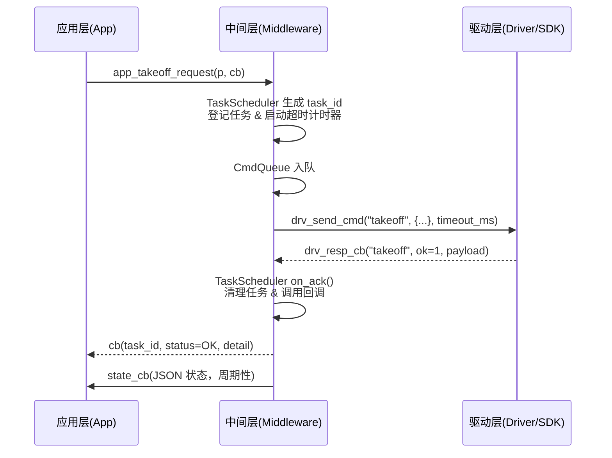

# 无人机控制模块代码设计

## 0 文档说明与写作规范

### 0.1 文档定位与适用范围

- **定位**：本文件是《无人机控制模块详细设计》的下位文档，用于指导代码实现。
- **适用范围**：本阶段仅覆盖 **起飞闭环（MVP）**，包含 App ⇄ Middleware ⇄ Driver 三层的接口、线程、时序、数据模型。
- **作用**：
  - 给开发：提供目录结构、接口签名、时序图等“施工蓝图”；
  - 给测试：提供用例矩阵、验收标准；
  - 给评审：保证详细设计 → 代码实现 → 测试的一致性。

### 0.2 写作原则

- **精确性**：必须精确到接口签名、线程职责、超时参数、日志字段；但不涉及具体算法/实现逻辑。
- **一致性**：所有命名、字段、错误码必须与详细设计保持一致；如有新增，必须在附录 A.2 记录 ADR。
- **可追踪性**：每个接口、字段、时序都必须能追溯到详细设计章节，并映射到测试用例。
- **前向兼容**：接口、数据结构的定义需考虑未来扩展（巡航、返航等）。

### 0.3 文档结构与输出物

- **章节结构**：严格对齐详细设计 1–9 章，每章细分 3–4 个子节，涵盖接口表、字段字典、时序图、状态机等。
- **输出物清单**（每章至少交付一种）：
  - 表格（字段表、互斥矩阵、错误码映射、测试矩阵）；
  - 图（架构图、时序图、状态机图）；
  - 模板（接口声明卡、用例卡）。
- **附录**：提供追踪矩阵、命名规范、表格模板。

### 0.4 评审与维护规范

- **版本管理**：每次修改需更新版本号和日期，记录在附录 A.2 变更记录。
- **评审方式**：通过追踪矩阵检查“详细设计→代码设计→测试”的覆盖完整性。
- **维护责任**：开发更新实现时，如影响接口/数据/时序，必须同步更新本文件。

## 1 设计范围与目标

### 1.1 本阶段需要解决的主要问题

- **业务目标**：在无人机控制模块中，优先实现 **起飞闭环（Takeoff Flow）**，作为最小可行产品（MVP）。
- **关键问题**：
  1. 应用层如何以统一 API 触发起飞指令，并异步获得结果。
  2. 中间层如何实现任务调度、命令队列管理、状态监测和异常处理。
  3. 驱动层如何可靠封装 SDK 通信，保障命令下发、应答解析、心跳与重连。
- **范围限制**：
  - 本阶段不涉及巡航、返航、复杂任务编排。
  - 状态数据可采用模拟/简化（高度、电量等核心字段）。
  - 异常处理策略仅覆盖超时、队列溢出、断链三类。

### 1.2 范围边界与成功判定标准

- **范围边界**：
  - **对上接口**：仅开放 `app_takeoff_request()`、`app_subscribe_state()`、`app_subscribe_event()` 三类 API。
  - **对下接口**：仅使用 `drv_connect()`、`drv_send_cmd()`、`drv_set_resp_callback()`、`drv_heartbeat()`、`drv_reconnect_if_needed()`。
  - **线程模型**：限定为“命令下发串行 + 状态监测周期线程 + 回调异步分发”。
- **成功判定标准**：
  1. 起飞命令能正确下发，并在 **2s 内收到 ACK**。
  2. 状态监测能以 **1s ± 10% 周期**输出高度与电量。
  3. 超时/断链/队列溢出能按预定义错误码和事件等级上报。
  4. 所有关键事件可通过日志追踪到 `task_id`。

### 1.3 量化指标（KPI）

- **功能性指标**：
  - ACK 成功率 ≥ 99%
  - ACK 延迟 P95 ≤ 2s
- **健壮性指标**：
  - 命令超时率 < 1%
  - 心跳成功率 ≥ 99%
  - 重连成功率 ≥ 95%
- **可观测性指标**：
  - 日志字段完整率 = 100%
  - 跨模块 task_id 一致率 = 100%
- **可维护性指标**：
  - 接口函数命名、错误码、配置键与详细设计文档完全一致。

## 2 架构分层与线程模型设计

### 2.1 模块划分与依赖关系

- **分层说明**：
  - **应用层（App）**：负责业务用例编排与 UI 对接，仅通过 `app_*` API 使用中间层；禁止直接访问 SDK。
  - **中间层（Middleware, MW）**：负责任务调度、命令队列、状态监测、异常处理与事件总线；对上暴露 API，对下调用 Driver。
  - **驱动层（Driver, DRV）**：负责 SDK 适配与通信，包含封包、超时、心跳、重连，不含业务逻辑。
- **依赖约束**：
  - 依赖方向 **App → MW → DRV**，单向闭环。
  - 禁止跨层访问，例如 App 直接调用 Driver。
  - 公共组件（日志、配置、时间）仅提供**无状态工具函数**，不得引入反向依赖。
- **目录结构**：

```c
src/
  app/            # 业务用例层
  middleware/     # 调度、队列、状态、异常、事件总线
  driver/         # SDK 适配与通信
  common/         # 日志、配置、时间、网络抽象
include/          # 对上 API 契约与公共头文件
examples/         # CLI 示例与测试桩
```

### 2.2 线程与并发模型

- **线程清单**：

  | 线程名称                                           | 所属层 | 职责                                          | 触发条件     | 退出条件   |
  | -------------------------------------------------- | ------ | --------------------------------------------- | ------------ | ---------- |
  | CmdQueue Worker                                    | MW     | 顺序出队命令，调用 Driver 下发                | 队列非空     | 模块析构   |
  | StateMonitor Timer                                 | MW     | 周期调用 `drv_heartbeat()` 并发布状态         | 定时周期     | 模块析构   |
  | Driver I/O Thread*                                 | DRV    | 监听 SDK 消息并触发回调（可选，MVP 可阻塞式） | connect 成功 | disconnect |
  | Callback Dispatch*                                 | MW     | 异步执行应用层回调（避免阻塞队列）            | 有回调任务   | 模块析构   |
  | * 注：MVP 阶段可合并至主线程，后续扩展为独立线程。 |        |                                               |              |            |

- **并发约束**：

  - 命令下发必须串行，确保 SDK 不被并发调用。
  - 应用层回调必须异步触发，避免阻塞 CmdQueue。
  - EventBus 发布订阅不得持有锁过久，必要时使用异步队列。

### 2.3 时限与互斥约束

- **超时预算表**：

  | 步骤         | 时限（ms） | 重试策略             | 超时事件等级     |
  | ------------ | ---------- | -------------------- | ---------------- |
  | 起飞命令 ACK | 2000       | 2 次退避，200ms 间隔 | ERROR            |
  | 状态发布周期 | 1000 ±10%  | N/A                  | WARN（偏差过大） |
  | 心跳丢失     | ≥3 周期    | 触发重连             | CRITICAL         |
  | 重连过程     | ≤5000      | 3 次退避             | CRITICAL         |

- **互斥矩阵**：

  | 资源         | 读方          | 写方            | 策略             |
  | ------------ | ------------- | --------------- | ---------------- |
  | 任务表       | AppFacade     | TaskScheduler   | mutex            |
  | 队列         | TaskScheduler | CmdQueue Worker | mutex + 条件变量 |
  | 订阅者表     | AppFacade     | EventBus        | mutex            |
  | 驱动连接状态 | StateMonitor  | SdkAdapter      | atomic<bool>     |


## 3 核心数据模型与流程设计

### 3.1 数据结构清单

- **命令消息（cmd_msg_t）**

  | 字段       | 类型   | 必填 | 默认     | 语义                   | 兼容说明                 |
  | ---------- | ------ | ---- | -------- | ---------------------- | ------------------------ |
  | task_id    | string | 是   | 自动生成 | 任务唯一标识           | 字符串形式，保证全局唯一 |
  | cmd        | string | 是   | -        | 命令名称（如 takeoff） | 保持小写，后续可扩展     |
  | json_param | string | 否   | "{}"     | 参数 JSON              | 参数键需前向兼容         |
  | timeout_ms | int    | 否   | 2000     | 超时阈值               | 默认值可配置             |

- **应答消息（ack_msg_t）**

  | 字段    | 类型   | 必填 | 默认 | 语义             | 兼容说明                |
  | ------- | ------ | ---- | ---- | ---------------- | ----------------------- |
  | task_id | string | 是   | -    | 对应的任务 ID    | 与 cmd_msg_t 匹配       |
  | ok      | int    | 是   | 0    | 0=成功，非0=失败 | 与 ErrorCode 枚举对应   |
  | detail  | string | 否   | -    | 附加信息         | JSON 或文本，保持可解析 |

- **状态（state_t）**

  | 字段    | 类型   | 必填 | 默认 | 语义           | 兼容说明       |
  | ------- | ------ | ---- | ---- | -------------- | -------------- |
  | alt     | float  | 是   | 0.0  | 当前高度（米） | 单位固定 m     |
  | battery | int    | 是   | -    | 电量百分比     | 范围 0–100     |
  | lat     | double | 否   | 0.0  | 纬度           | 可选，未来扩展 |
  | lon     | double | 否   | 0.0  | 经度           | 可选，未来扩展 |

- **事件（event_t）**

  | 字段     | 类型   | 必填 | 默认 | 语义                                         | 兼容说明     |
  | -------- | ------ | ---- | ---- | -------------------------------------------- | ------------ |
  | severity | int    | 是   | 0    | 事件等级（0=INFO,1=WARN,2=ERROR,3=CRITICAL） | 对应日志等级 |
  | name     | string | 是   | -    | 事件名称（timeout, reconnect 等）            | 统一命名规范 |
  | json_ctx | string | 否   | -    | 上下文 JSON（附加参数/原因）                 | 可前向兼容   |

### 3.2 数据序列化与演进

- **格式**：统一使用 JSON 字符串。
- **命名规范**：字段全部小写 + 下划线，例如 `altitude_m`。
- **空值策略**：可选字段缺省时应省略，不返回 null。
- **前向兼容**：
  - 新增字段必须可选，老版本可忽略。
  - 删除字段需保留至少一个兼容版本周期。
- **Schema 管理**：
  - 每个结构体对应一份 JSON 示例（附录 A.4）。
  - 提供 Schema 校验工具（后续 CI 可加入）。

### 3.3 流程机制

- **命令流（Command Flow）**
  1. App 调用 `app_takeoff_request()` → TaskScheduler 生成 task_id 并入队。
  2. CmdQueue 顺序出队 → 调用 Driver `drv_send_cmd()`。
  3. Driver 回调 ACK → TaskScheduler 映射到回调 → 通知 App。
- **状态流（State Flow）**
  1. StateMonitor 定时调用 `drv_heartbeat()`。
  2. Driver 返回最新状态或假数据。
  3. StateMonitor 封装为 state_t JSON → EventBus 发布 → App 订阅接收。
- **异常流（Event Flow）**
  1. 异常触发（超时/断链/队列溢出）。
  2. ExceptionManager 生成 event_t（severity+name+json_ctx）。
  3. EventBus 发布 → App 订阅接收。

## 4 输入处理与异常策略

### 4.1 应用层（App）

#### 4.1.1 输入校验

- 入口：`app_takeoff_request(p, cb)`
- 校验规则（失败返回 `ERR_INVALID_ARG`，不同步入队）：
  - `p != nullptr`、`cb != nullptr`
  - `0 < altitude_m ≤ 5.0`
  - `0 < speed_mps ≤ 2.0`
- 回调语义：仅在任务被受理后才会触发异步回调；参数错误直接同步返回错误码，不触发回调。

#### 4.1.2 异常反馈

- 队列已满：`ERR_QUEUE_FULL`（建议上层退避重试）
- 立即可见的前置异常（如模块未初始化）：统一返回非零错误码并写日志 `event=reject_precheck`

#### 4.1.3 观测与记录

- 入参校验失败、成功受理均写日志（含 `task_id` 或 `-` 占位）
- 与 UI 的状态/事件订阅无需阻塞：订阅失败记 `event=subscribe_fail`

### 4.2 中间层（Middleware）

#### 4.2.1 输入处理路径

- **AppFacade**
  - 生成 `task_id`
  - 组装 `cmd_msg_t`（`cmd="takeoff"`）
  - 投递至 `TaskScheduler`
- **TaskScheduler**
  - 登记在途任务，启动超时计时（默认 `timeout_ms=2000`，可覆盖）
  - 投递至 `CmdQueue`（若超过上限，返回 `ERR_QUEUE_FULL`）
- **CmdQueue**
  - FIFO 单消费下发至 `drv_send_cmd()`
- **StateMonitor**
  - 周期 `heartbeat` 与状态发布，不与命令通路互相阻塞

#### 4.2.2 异常分类与处理

- **命令超时（ACK 未达）**
  - 触发：`timeout_ms` 到期
  - 动作：
    - 计入重试计数，默认重试 2 次，间隔 200ms（退避策略）
    - 达上限：回调 `ERR_TIMEOUT`；发布事件 `name=timeout`
- **队列溢出**
  - 触发：`size > ctrl.queue.max_len`
  - 动作：拒绝新任务 → 返回 `ERR_QUEUE_FULL`；发布 `name=queue_full`
- **心跳失联**
  - 触发：连续 3 次心跳失败
  - 动作：调用 `drv_reconnect_if_needed()`；成功→`event=reconnect_success`，失败→`event=reconnect_fail`（CRITICAL）
- **状态丢失/异常**
  - 触发：两个周期未发布状态或字段异常
  - 动作：发布 `name=state_anomaly`（WARN）

#### 4.2.3 回调与线程安全

- 驱动回调 → `TaskScheduler::on_ack()` 将 `ack_msg_t` 与 `task_id` 关联
- 应用层回调异步分发（不得在队列线程内直接调用）
- 共享结构（在途表、订阅表）需加互斥；计时使用单调时钟

#### 4.2.4 观测与日志

- 关键埋点：`submit`、`send_cmd`、`ack_received`、`timeout`、`queue_full`、`reconnect_*`
- 统一字段：`ts,module,level,event,task_id`
- 指标：ACK 延迟、队列长度、超时率、心跳成功率

### 4.3 驱动层（Driver）

#### 4.3.1 输入处理

- 接口：`drv_send_cmd(cmd, json_param, timeout_ms)`
- 要求：
  - 串行发送（由中间层保证）；驱动内部不得再并发执行同类命令
  - 如未连接，立即返回 `ERR_NOT_CONNECTED`
  - 发送失败/IO 异常返回 `ERR_SDK_IO`
- 回调：`drv_resp_cb_t(cmd, ok, payload)`
  - `ok=1`：成功；`ok=0`：失败（`payload` 携带错误详情 JSON）

#### 4.3.2 异常策略

- **未连接**
  - 返回 `ERR_NOT_CONNECTED`
  - 交由中间层触发重连；驱动提供 `drv_reconnect_if_needed()`
- **IO/SDK 异常**
  - 返回 `ERR_SDK_IO` 并尽可能提供 `payload` 原始上下文
- **心跳失败**
  - `drv_heartbeat()` 连续失败应可被中间层统计；驱动维持最小状态位

#### 4.3.3 时限与退避

- 发送侧遵循中间层给定的 `timeout_ms`；不擅自改写
- 重连退避策略由中间层主导；驱动侧只提供最小原语

#### 4.3.4 观测与日志

- 关键埋点：`connect`、`send_cmd`、`recv_ack`、`heartbeat`、`reconnect`
- 不输出业务语义，只记录通信层事件与错误码映射

### 4.4 测试与验收要点（对应本章）

- 参数校验立即拒绝并返回 `ERR_INVALID_ARG`
- 超时后按“2 次 × 200ms 退避”执行重试；超过上限返回 `ERR_TIMEOUT` 且有事件日志
- 队列满时拒绝新任务并上报 `queue_full`
- 心跳连续 3 次失败触发重连；重连结果事件分别上报
- 所有异常路径均能通过日志追踪到对应 `task_id`

## 5 接口契约与通信规范

### 5.1 应用层 ⇄ 中间层 契约

#### 5.1.1 函数声明

- **起飞请求**

  ```
  const char* app_takeoff_request(const takeoff_param_t* p, task_cb_t cb);
  ```

  - 输入：`takeoff_param_t{ altitude_m, speed_mps }`
  - 输出：返回 `task_id`（字符串指针，内部持有）
  - 回调：`task_cb_t(task_id, status, detail)`
    - status：0=成功，非0=错误码
    - detail：错误信息或 SDK 返回内容

- **状态订阅**

  ```
  int app_subscribe_state(state_cb_t cb);
  ```

  - 输入：回调函数指针

  - 回调：周期触发，参数为 JSON 字符串

    ```
    { "alt": 1.2, "battery": 90, "lat": 0.0, "lon": 0.0 }
    ```

- **事件订阅**

  ```
  int app_subscribe_event(event_cb_t cb);
  ```

  - 输入：回调函数指针

  - 回调：异常/告警事件

    ```
    { "severity": 2, "name": "timeout", "json_ctx": "{\"cmd\":\"takeoff\"}" }
    ```

#### 5.1.2 契约约束

- **幂等性**：同一 `task_id` 的回调只触发一次成功或失败。
- **重入安全**：API 可被多线程调用，但内部必须线程安全。
- **回调触发**：必须异步，不允许在 API 调用栈内直接执行。
- **时限**：
  - 起飞 ACK ≤ 2s
  - 状态发布周期 1s ±10%

### 5.2 中间层 ⇄ 驱动层 契约

#### 5.2.1 驱动函数声明

- **建立连接**

  ```
  int drv_connect(const char* ip, int port);
  ```

- **下行命令**

  ```
  int drv_send_cmd(const char* cmd, const char* json_param, int timeout_ms);
  ```

- **应答回调注册**

  ```
  typedef void(*drv_resp_cb_t)(const char* cmd, int ok, const char* payload);
  int drv_set_resp_callback(drv_resp_cb_t cb);
  ```

- **心跳与自愈**

  ```
  int drv_heartbeat();
  int drv_reconnect_if_needed();
  ```

#### 5.2.2 契约约束

- **串行保障**：中间层必须保证调用 `drv_send_cmd()` 时不并发。
- **回调时限**：必须在 `timeout_ms` 内返回，否则由中间层触发超时。
- **错误码**：
  - `ERR_NOT_CONNECTED` → 未建立连接
  - `ERR_SDK_IO` → IO/协议错误
- **回调参数**：
  - `ok=1` 表示成功，`ok=0` 表示失败
  - `payload` 必须是 JSON 字符串，至少包含 `"task_id"`

### 5.3 通信与数据规范

#### 5.3.1 数据格式

- **统一 JSON**：所有参数与应答均为 JSON 字符串

- **字段规范**：小写+下划线，例如 `altitude_m`

- **示例**：

  - **Takeoff 请求**

    ```
    { "altitude_m": 1.5, "speed_mps": 0.6 }
    ```

  - **ACK 应答**

    ```
    { "task_id": "task-42", "ok": 1, "detail": "takeoff acknowledged" }
    ```

#### 5.3.2 版本演进策略

- 新增字段：必须为可选，默认值与旧版本兼容
- 删除字段：需至少一个版本周期的兼容期
- 数据 Schema：由中间层统一管理，驱动层只负责传输

#### 5.3.3 安全与健壮性

- 输入 JSON 必须校验字段存在性与类型
- 出现未知字段时记录 WARN 日志但不中断流程
- 通信异常时，驱动必须返回错误码并带上 `payload` 说明

## 6 时序设计与状态机

### 6.1 起飞闭环时序

### 标准时序流程（Takeoff Usecase）



### 时序约束

- 从 `app_takeoff_request()` 到收到 ACK 回调 ≤ 2s。
- 状态发布周期：1s ± 10%。
- 日志追踪：全链路必须记录相同 `task_id`。

### 6.2 任务状态机

### 状态定义

| 状态      | 描述             | 进入条件                | 退出条件        | 事件              |
| --------- | ---------------- | ----------------------- | --------------- | ----------------- |
| INIT      | 新建任务，未入队 | API 调用成功            | 入队成功        | -                 |
| QUEUED    | 已进入命令队列   | 任务入队                | 被取出并下发    | -                 |
| IN_FLIGHT | 已下发，等待 ACK | 调用 drv_send_cmd 成功  | 收到 ACK / 超时 | -                 |
| SUCCESS   | 成功结束         | 收到 ok=1 的 ACK        | 状态回调完成    | event=ack_success |
| FAILED    | 异常结束         | 超时/队列满/IO 错误     | 上报回调        | event=ack_fail    |
| RETRYING  | 正在重试         | 超时触发 & 未达重试上限 | 重新下发        | event=retry       |

### 转移规则

- `INIT → QUEUED → IN_FLIGHT` 为正常链路。
- `IN_FLIGHT → SUCCESS`：收到 ACK 成功。
- `IN_FLIGHT → RETRYING → IN_FLIGHT`：超时但未超上限。
- `IN_FLIGHT → FAILED`：超时超限 / 驱动错误。
- `QUEUED → FAILED`：队列溢出直接拒绝。

### 6.3 超时与重试机制

### 超时控制

- 每个任务持有 `timeout_ms`（默认 2000）。
- TaskScheduler 使用单调时钟检测超时。
- 超时触发：
  - 记录日志 `event=timeout`；
  - ExceptionManager 上报事件。

### 重试机制

- 最大次数：2 次。
- 退避间隔：200ms。
- 重试仍失败 → 转移到 FAILED。

### 心跳与重连

- 心跳周期：1000ms。
- 连续 3 次失败 → 调用 `drv_reconnect_if_needed()`。
- 重连成功 → event=reconnect_success（INFO）。
- 重连失败 → event=reconnect_fail（CRITICAL）。

## 7 扩展性与维护策略

## 8 日志与可观测性设计

## 9 用例流程与验收标准
