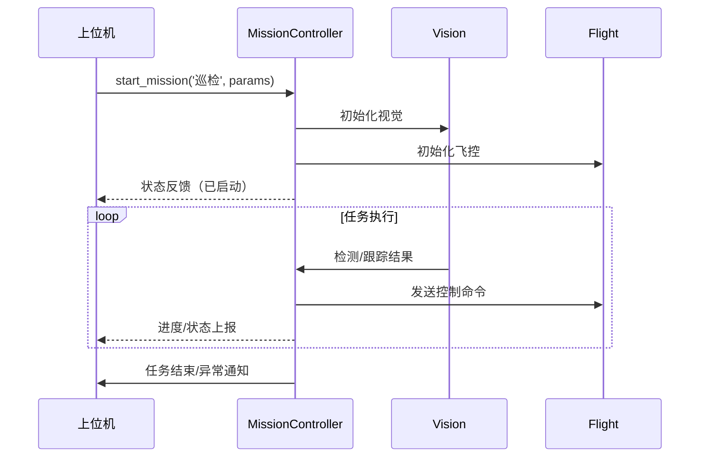
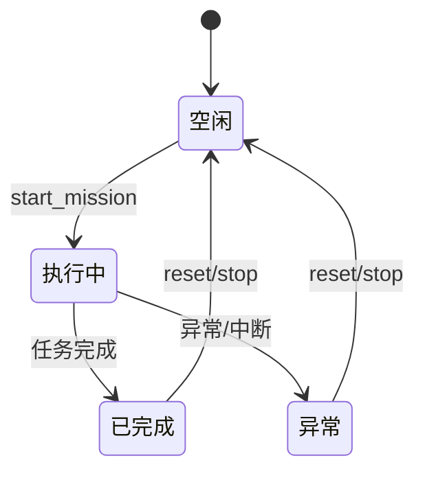

# 控制模块（主流程/任务调度）设计

---

## 1. 模块概述

- **功能定位：**  
  控制整个无人机系统的任务流转、模式切换、任务调度与状态管理。  
  对接上位机指令，实现“自动巡检/目标跟踪”等核心功能的统一入口与调度。

- **对应需求：**  
  BR-01（自动巡检/跟踪）、BR-07（定时任务）

---

## 2. 类/方法结构设计

- **主控制类：** `MissionController`
    - 负责各任务的统一管理、调度切换、状态反馈

### 类结构示意

```python
class MissionController:
    def __init__(self, config):
        ...
    def start_mission(self, task_type: str, params: dict) -> bool:
        ...
    def switch_task(self, new_task: str) -> bool:
        ...
    def stop_mission(self) -> bool:
        ...
    def get_status(self) -> dict:
        ...
    def handle_event(self, event: str, payload: dict) -> None:
        ...
```

## 3 方法参数说明表

| 方法名        | 参数名    | 类型 | 说明                    | 返回值/类型          |
| ------------- | --------- | ---- | ----------------------- | -------------------- |
| start_mission | task_type | str  | 任务类型（巡检/跟踪等） | bool（启动是否成功） |
|               | params    | dict | 任务相关配置参数        |                      |
| switch_task   | new_task  | str  | 切换至的新任务类型      | bool                 |
| stop_mission  | 无        | —    | 停止当前任务            | bool                 |
| get_status    | 无        | —    | 获取当前系统状态        | dict                 |
| handle_event  | event     | str  | 外部事件类型            | None                 |
|               | payload   | dict | 事件相关数据            |                      |

## 4 关键数据结构

MissionStatus（任务状态结构）

| 字段名       | 类型  | 说明                           |
| ------------ | ----- | ------------------------------ |
| mission_id   | str   | 当前任务唯一标识               |
| mission_type | str   | 任务类型（巡检/跟踪）          |
| state        | str   | 运行状态（进行中/已完成/异常） |
| progress     | float | 任务进度（0~1）                |
| error_code   | int   | 错误码（0为正常）              |
| timestamp    | float | 更新时间戳                     |

## 5 典型流程与状态机

### 5.1 主流程时序图



### 5.2 任务状态转化图



## 6 主要异常处理/边界情况

- 启动任务失败（参数不全/依赖未初始化/通信异常）

- 执行过程中遇到传感器/视觉/飞控异常

- 上位机强制切换/终止任务时的安全收口逻辑

- 任务完成/中断时的资源释放与状态回归

## 7 典型用例/调用示例

- 启动自动巡检任务

```text
mission = MissionController(config)
mission.start_mission('patrol', params)
```

- 切换到目标追踪

```txt
mission.switch_task('tracking')
```

- 获取当前状态

```txt
status = mission.get_status()
print(status)
```

## 8. 对接关系与扩展

- 通过事件/回调/消息总线与视觉模块、飞控模块、日志/上位机模块解耦
- 保留 hook / plugin / 事件机制，便于后续扩展新的任务类型