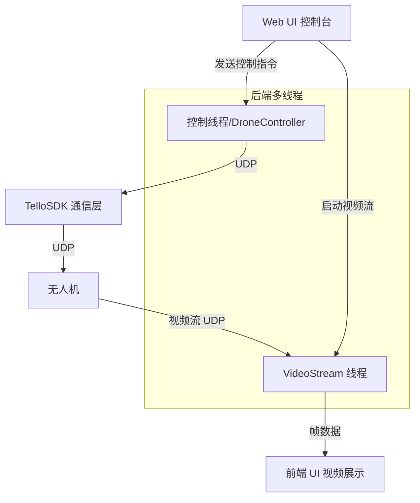

# 系统流程设计文档

## 1 总体运行流程

本系统支持通过Web界面（Streamlit等）远程控制Tello无人机，并实时获取其摄像头视频流。整体流程包括：用户操作UI界面，后端将控制指令发送给无人机，同时接收、解码并展示视频流画面。所有通信均采用多线程模型，保证指令与视频流互不阻塞。

---

## 2 主要子流程

### 2.1 UI控制指令流

- 用户在Web界面点击按钮（如起飞、降落、移动等）。
- 前端通过事件触发，将指令传递到后端控制模块。
- 控制模块通过无人机SDK（TelloSDK类）下发命令，并实时记录日志。
- 所有控制命令通过UDP端口与无人机通信，并处理返回状态。

### 2.2 视频流采集与处理

- 用户触发“开启视频流”后，系统发送 `streamon` 指令至无人机。
- 启动独立线程或VideoStream类，通过OpenCV捕获UDP端口视频流。
- 实时解码视频帧并送往Web前端显示（streamlit image或自定义UI组件）。
- 支持帧处理/保存/分析等扩展。

### 2.3 控制与采集的线程/异步模型

- 控制命令与视频流分别运行在独立线程（或异步任务）中。
- 保证指令流畅下发，视频流稳定刷新。
- 支持多线程安全退出与资源释放。

### 2.4 退出与异常处理

- 用户关闭Web端或主动断开时，所有线程应优雅停止并释放资源。
- 端口被占用/无人机断开等异常会自动捕获，并给出用户提示。

---

## 3 核心流程图

## 4 各流程关键节点说明

- **Web UI 控制台**：所有操作入口，包含指令、日志和视频显示。

- **DroneController**：负责调度所有与无人机相关的指令调用与状态管理，提供线程安全控制。

- **TelloSDK**：底层UDP通信，负责与无人机之间的握手、命令发送与回应处理，包含多线程接收处理。

- **VideoStream**：独立线程/类，从UDP端口实时采集视频帧，支持状态判断与流重连。

- **异常捕获**：所有socket/线程相关异常统一捕获，关键状态变更均写入日志。

## 5 常见异常流程与系统恢复

- **端口占用/多开冲突**：端口绑定失败自动提示，并阻止程序二次启动。
- **无人机断开/未回应**：下发指令/采集帧超时自动重试，失败写入日志。
- **线程意外退出**：退出时自动关闭socket，join线程，避免僵尸进程。
- **多线程同步**：所有关键数据/状态修改前均加锁/线程安全操作。